# About PROVES Library

PROVES Library is an open-source project that uses AI agents to capture, organize, and share knowledge from CubeSat missions — preventing teams from repeating the same failures.

---

## The Vision

**Every university CubeSat team should benefit from every other team's experience.**

Right now, knowledge is trapped:
- In Slack threads that disappear
- In commits that nobody reads
- In the minds of students who graduate
- In documents that go stale

PROVES Library changes this by automatically extracting knowledge and making it queryable.

---

## How It Works

```mermaid
graph LR
    A[📄 Documentation] -->|AI reads| B[🤖 Curator Agent]
    B -->|Extracts| C[🔗 Dependencies]
    C -->|Stores in| D[🗄️ Knowledge Graph]
    D -->|Powers| E[🔍 Queries]
```

1. **AI reads documentation** from F´ Framework, PROVES Kit, and university repos
2. **Curator Agent extracts** dependencies and relationships
3. **Humans review** mission-critical items before storage
4. **Knowledge graph grows** with every extraction
5. **Teams query** to find connections and avoid past mistakes

---

## The Technology

| Component | What It Does |
|-----------|--------------|
| **LangGraph** | Orchestrates multi-step agent workflows |
| **Claude Sonnet 4.5** | Extracts dependencies from documentation |
| **Claude Haiku 3.5** | Validates and stores (90% cheaper) |
| **Neon PostgreSQL** | Hosts the knowledge graph |
| **pgvector** | Enables semantic search |

---

## Current Status

| Phase | Status | Description |
|-------|--------|-------------|
| Trial Mapping | ✅ Complete | Manual analysis of 45+ dependencies |
| Infrastructure | ✅ Complete | Database schema, utilities, checkpointing |
| Curator Agent | 🔄 In Progress | LangGraph workflows with HITL |
| MCP Server | 📋 Planned | Query interface for AI tools |
| Risk Scanner | 📋 Planned | Scan repos for known patterns |
| VS Code Extension | 📋 Planned | IDE integration |

---

## Who's Behind This

**Elizabeth Osborn**  
Researcher at Cal Poly Pomona  
[eosborn@cpp.edu](mailto:eosborn@cpp.edu)

This project combines:
- **PROVES Kit** — Cal Poly's open-source CubeSat hardware
- **F´ Framework** — NASA/JPL's flight software framework
- **Modern AI** — LangGraph agents with Claude models

---

## Contributing

PROVES Library is open source. Contributions welcome!

- **Code:** [github.com/Lizo-RoadTown/PROVES_LIBRARY](https://github.com/Lizo-RoadTown/PROVES_LIBRARY)
- **Issues:** Report bugs or suggest features
- **Documentation:** Help improve the knowledge base

See the [For Developers](/proveskit-agent/developers/) page for setup instructions.

---

## License

MIT License — Use freely, contribute back.

---

## Acknowledgments

- **NASA/JPL** — F´ flight software framework
- **Cal Poly Pomona** — PROVES Kit CubeSat platform
- **Anthropic** — Claude AI models
- **LangChain** — LangGraph agent framework
- **Neon** — Serverless PostgreSQL

---

[← Back to Home](/proveskit-agent/)
