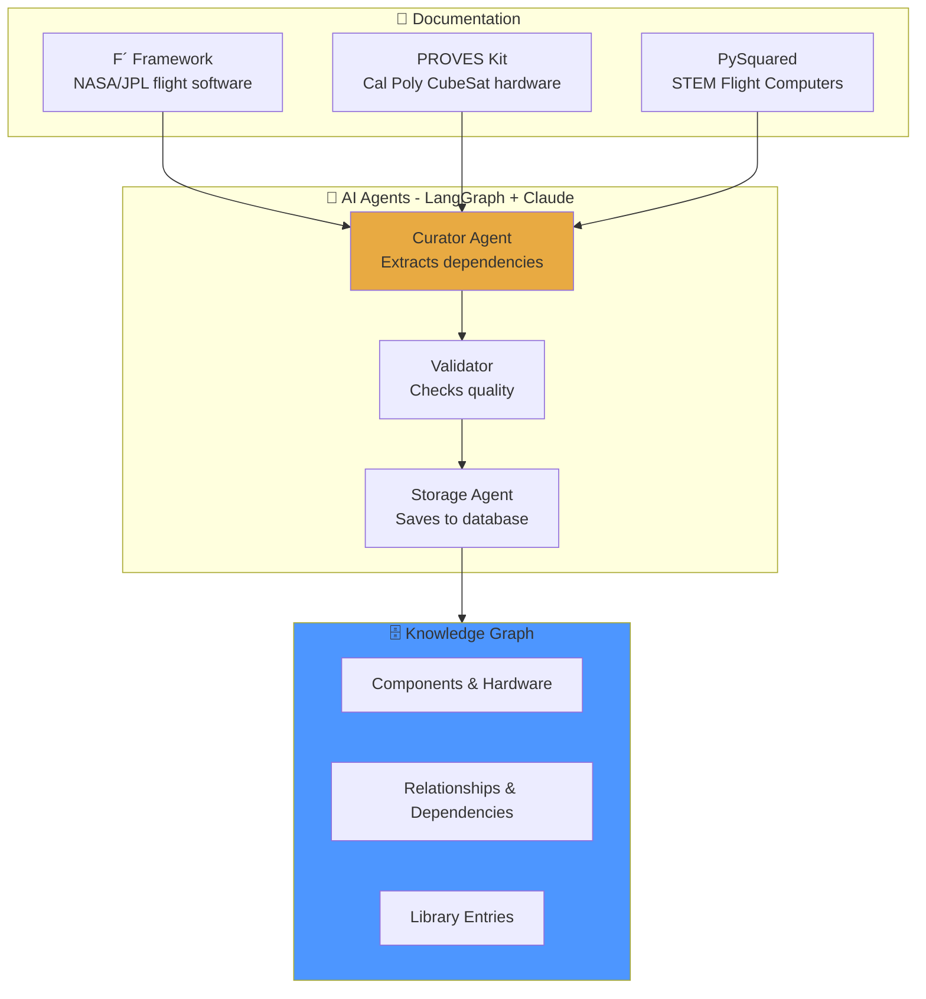

# 🛰️ PROVES Library

**AI-powered knowledge capture for CubeSat missions**

Building a satellite is hard. Building one without repeating past mistakes is harder. PROVES Library uses AI agents to capture, organize, and share knowledge so every university team can learn from each other.

---

## The Problem: Knowledge Gets Lost

University CubeSat programs face a tough reality:

| Challenge | Impact |
|-----------|--------|
| **Fragmented knowledge** | Fixes live in Slack threads, commits, and graduation memories |
| **Hidden dependencies** | Changing power code breaks I2C sensors two weeks before launch |
| **Isolated teams** | Every university discovers the same failures independently |
| **Time pressure** | No time to document when you're racing toward launch |

**The result:** 88% of university CubeSat programs fail from organizational issues, not technical ones. The knowledge exists — it's just not accessible.

---

## The Solution: AI-Powered Knowledge Capture



**How it works:**
1. **AI reads documentation** — Curator Agent extracts dependencies and relationships
2. **Human reviews critical items** — HIGH criticality dependencies need approval
3. **Knowledge graph grows** — Structured data makes relationships queryable
4. **Teams benefit** — Query the graph to find hidden connections

---

## What Makes This Different

### 🧠 Intelligence, Not Automation

The Curator Agent doesn't just copy text — it **understands** relationships:

```
Input:  "The I2C driver requires the LinuxGpioDriver for reset functionality"
Output: 
  - Source: LinuxI2cDriver
  - Target: LinuxGpioDriver  
  - Relationship: depends_on
  - Criticality: HIGH
  - Evidence: Line 47-52, I2C_Driver.md
```

### 🔗 Structured Knowledge Graph

Not just documents — a queryable graph with 6 relationship types:

| Relationship | Meaning | Example |
|--------------|---------|---------|
| `depends_on` | Runtime dependency | IMU Manager → I2C Driver |
| `requires` | Build-time requirement | Component → Toolchain |
| `enables` | Makes possible | Load Switch → Sensor Power |
| `conflicts_with` | Cannot coexist | UART Debug ↔ Radio TX |
| `mitigates` | Reduces risk | Watchdog → Infinite Loop |
| `causes` | Leads to | Brownout → State Corruption |

### 👤 Human-in-the-Loop

Mission-critical dependencies require human approval before storage:

```
[CURATOR] Found HIGH criticality dependency:
  LinuxI2cDriver → LinuxGpioDriver (depends_on)
  Reason: Reset line timing failure = I2C bus hang
  
  Approve? [y/n]
```

---

## Current Architecture

```
┌─────────────────────────────────────────────────────────────────┐
│                    PROVES Library System                        │
├─────────────────────────────────────────────────────────────────┤
│                                                                 │
│  📄 Documentation Sources                                       │
│     ├── F´ Framework (NASA/JPL flight software)                │
│     └── PROVES Kit (Cal Poly Pomona CubeSat hardware)          │
│                          ↓                                      │
│  🤖 Deep Agent System (LangGraph + Claude)                      │
│     ┌─────────────────────────────────────────┐                │
│     │  Main Curator Agent (Sonnet 4.5)        │                │
│     │     ↓ spawns as tools                   │                │
│     │  ├── Extractor (Sonnet 4.5)             │                │
│     │  ├── Validator (Haiku 3.5) ← 90% cheaper│                │
│     │  └── Storage   (Haiku 3.5) ← 90% cheaper│                │
│     └─────────────────────────────────────────┘                │
│                          ↓                                      │
│  👤 Human-in-the-Loop (HITL)                                    │
│     └── HIGH criticality deps require approval                 │
│                          ↓                                      │
│  🗄️ Neon PostgreSQL + pgvector                                 │
│     ├── kg_nodes (components, hardware, patterns)              │
│     ├── kg_relationships (ERV dependency types)                │
│     └── library_entries (source documentation)                 │
│                                                                 │
└─────────────────────────────────────────────────────────────────┘
```

### Why This Design?

| Decision | Rationale |
|----------|-----------|
| **Sub-agents as tools** | Each agent is an expert at one thing |
| **Haiku for simple tasks** | 90% cost savings on validation/storage |
| **Sonnet for extraction** | Complex reasoning where quality matters |
| **HITL for HIGH criticality** | Mission-critical deps need human eyes |

---

## Project Status (December 2025)

### ✅ Phase 1: Trial Mapping — COMPLETE
- Analyzed F´ I2C Driver (411 lines) + PROVES Kit Power Management (154 lines)
- **Found 45+ dependencies** with exact line citations
- **Discovered 4 critical cross-system dependencies** undocumented anywhere
- **Identified 5 knowledge gaps** (timing specs, voltage requirements, error recovery)

### ✅ Phase 2: Infrastructure — COMPLETE
- Neon PostgreSQL database with 9-table knowledge graph schema
- LangGraph checkpointer for agent state persistence
- Python utilities for database management

### 🔄 Phase 3: Curator Agent — IN DEVELOPMENT
- LangGraph orchestration with sub-agents-as-tools pattern
- Claude Sonnet 4.5 (curator/extractor) + Haiku 3.5 (validator/storage)
- Human-in-the-loop for HIGH criticality dependencies
- **Current focus:** Autonomous document exploration

### 📋 Phase 4: Planned Features
- **MCP Server** — Model Context Protocol endpoints for AI tool access
- **Risk Scanner** — Scan repos for known risk patterns
- **VS Code Extension** — IDE integration for real-time scanning
- **Training Pipeline** — Local LLM fine-tuning for CubeSat domain

---

## Who Is This For?

### 🎓 Students Starting a CubeSat Program

> "What mistakes did other teams make with power systems?"

Query the knowledge graph to learn from others before making the same errors.

### 🔧 Developers Building Flight Software

> "What happens if I change this I2C driver?"

Trace dependencies to understand cascading effects before they break things.

### 🤖 AI/ML Engineers Interested in Agents

> "How do you build agents that work with humans?"

Study the LangGraph patterns, sub-agent architecture, and HITL workflows.

### 🛰️ CubeSat Enthusiasts

> "How does all this space stuff fit together?"

Explore the knowledge graph to understand how components connect.

---

## Technology Stack

| Layer | Technology | Purpose |
|-------|------------|---------|
| **AI Framework** | LangGraph | Agent orchestration and workflows |
| **LLM** | Claude Sonnet 4.5 + Haiku 3.5 | Extraction and validation |
| **Database** | Neon PostgreSQL + pgvector | Knowledge graph with semantic search |
| **Tracing** | LangSmith (optional) | Agent debugging and monitoring |
| **Language** | Python 3.11+ | All agent and utility code |

---

## Learn More

- **[Living Library](/proveskit-agent/living-library/)** — How knowledge gets captured and organized
- **[Architecture](/proveskit-agent/architecture/)** — Deep dive into knowledge graph + agents
- **[Technical](/proveskit-agent/technical/)** — System design and data flow
- **[For Developers](/proveskit-agent/developers/)** — How to use and contribute
- **[For Researchers](/proveskit-agent/researchers/)** — Research questions and evaluation

**Implementation:**
- [PROVES_LIBRARY Repository](https://github.com/Lizo-RoadTown/PROVES_LIBRARY) — Working code
- [GETTING_STARTED.md](https://github.com/Lizo-RoadTown/PROVES_LIBRARY/blob/master/GETTING_STARTED.md) — Set up in 15 minutes
- [CANON.md](https://github.com/Lizo-RoadTown/PROVES_LIBRARY/blob/master/CANON.md) — Core principles and patterns

---

## Contact

**Elizabeth Osborn** | Cal Poly Pomona  
[eosborn@cpp.edu](mailto:eosborn@cpp.edu)

**Project Status:** Active development | December 2025
