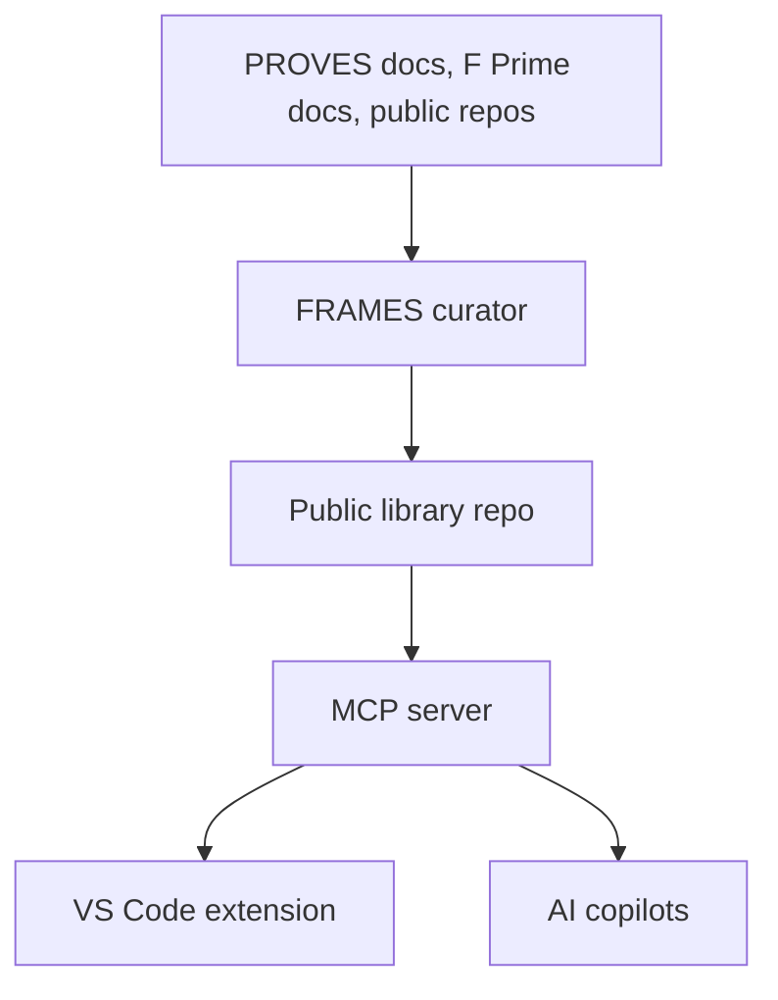

# Living Documentation and Risk Scanning for CubeSat Teams

**PROVES Kit Agent** is a public, MCP-backed knowledge system for university CubeSat teams. It focuses on two things:

1) A living documentation library students can interrogate in VS Code
2) A repo risk scan extension that flags mission-critical issues and links to fixes

---

## The Challenge

University CubeSat teams face repeatable problems:

- Knowledge loss when students rotate out
- No shared way to learn from failures across universities
- Little or no pre-flight risk analysis
- Mission-critical issues discovered too late

---

## What It Does

| Capability | Description |
|------------|-------------|
| **Living Documentation** | MCP library with lessons, docs, and risk patterns linked to artifacts |
| **Risk Scan Extension** | VS Code scan that flags likely mission-critical issues with fixes |

---

## How It Works

- Sources are indexed as citations and excerpts only
- Entries are reviewed before being added to the public library
- The MCP server exposes the library for search and retrieval
- The VS Code extension uses those patterns to scan a repo for risk

---

## Living Documentation Library

The library is the shared memory for every team. It stores:

- Lessons learned with links to artifacts
- Risk patterns and how to verify fixes
- Proven configuration guidance

[Living Documentation Library](https://lizo-roadtown.github.io/proveskit-agent/living-library/)

---

## Why PROVES and F Prime

PROVES Kit and F Prime are the core sources for the library because they are the shared baseline for the teams we serve.

---

## Relationship to FRAMES

FRAMES provides the structural lens: the system owns outcomes, not individuals. The library logs where fixes live, not who caused problems.

---

## Status

This repository is a public scrapbook for the concept and documentation. The working implementation will live in a separate repository.

---

## Contact

**Elizabeth Osborn** | Cal Poly Pomona  
[eosborn@cpp.edu](mailto:eosborn@cpp.edu)

