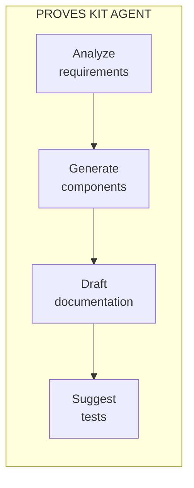

# Agentic AI for F'Prime Flight Software Development

**PROVES Kit Agent** is an intelligent assistant system designed to support CubeSat mission engineers working with NASA's **F'Prime** (F´) flight software framework.

---

## The Challenge

F'Prime development involves complex workflows across multiple domains:

- **Component development** — Writing flight-ready C++ components with ports, commands, telemetry, and events
- **Topology design** — Connecting components into deployable flight software architectures
- **Documentation** — Maintaining technical specifications, interface definitions, and requirements traceability
- **Testing & validation** — Unit tests, integration tests, and flight qualification procedures
- **Knowledge transfer** — Onboarding new team members to F'Prime patterns and mission-specific architectures

University CubeSat programs face additional challenges: **student rotation creates constant knowledge loss**, and **teams must deliver flight-qualified software with limited prior experience**.

---

## What PROVES Kit Agent Does

An agentic AI system that assists F'Prime developers through the full development lifecycle:

| Capability | Description |
|------------|-------------|
| **Component Generation** | Draft F'Prime components from specifications with proper port definitions |
| **Documentation Support** | Auto-generate interface definitions, command dictionaries, telemetry tables |
| **Code Review** | Check F'Prime patterns, detect common errors, suggest improvements |
| **Living Documentation** | Interrogatable library of lessons, docs, and risk patterns with MCP access |

---

## How It Works

### Agent Architecture

Built on the same multi-agent framework as **FRAMES**, but applied to F'Prime engineering workflows:

- **Requirement Analyzer** — Extracts component specifications from natural language or documents
- **Component Generator** — Creates F'Prime `.fpp` files, C++ implementations, and test scaffolds
- **Documentation Agent** — Maintains interface specifications and requirements traceability
- **Review Agent** — Validates F'Prime patterns, checks port connections, identifies issues

### Integration with F'Prime

Works directly with F'Prime tooling:

- Reads `.fpp` (F Prime Prime) component and topology definitions
- Generates compliant C++ code following F'Prime patterns
- Integrates with `fprime-util` build and test workflows
- Supports F'Prime autocoding and component templates

---

## Living Documentation and Risk Scan

The agent now supports a deeper layer of documentation that students can interrogate through an MCP server and a VS Code extension.

- MCP library holds docs, lessons, and risk patterns
- VS Code extension scans repos for mission-critical risks
- Results link to real fixes and source artifacts
- No names or blame. The structure owns outcomes

[Living Documentation Library](https://lizo-roadtown.github.io/proveskit-agent/living-library/)

---

## PROVES Kit Project

This agent system supports the **PROVES Kit** multi-university collaboration:

**[PROVES Kit on GitHub →](https://github.com/proveskit)**

PROVES Kit develops open-source payloads and bus systems for CubeSat missions, using F'Prime as the flight software framework. Partner universities include:

Cal Poly Pomona · Columbia University · Texas State University · Virginia Tech · Washington State University · University of Illinois · Northeastern University · Mt. San Antonio College

---

## Key Features

<h3>F'Prime Component Generator</h3>

Generate components from natural language requirements—ports, commands, telemetry, events, and parameters.

<a href="/proveskit-agent/component-generation/">Learn more →</a>

<h3>Interactive Documentation</h3>

Auto-draft interface control documents, command dictionaries, and telemetry tables from component definitions.

<a href="/proveskit-agent/documentation/">Learn more →</a>

<h3>Code Review Assistant</h3>

Validate F'Prime patterns, check topology connections, and suggest improvements.

<a href="/proveskit-agent/code-review/">Learn more →</a>

<h3>Living Documentation Library</h3>

A shared library of lessons, docs, and risk patterns accessible through MCP and VS Code.

<a href="/proveskit-agent/living-library/">Learn more</a>

---

## Why F'Prime?

**F'Prime** is NASA JPL's open-source flight software framework, designed for CubeSats and small spacecraft:

- **Component-based architecture** — Reusable, testable software modules
- **Cross-platform** — Runs on Linux, embedded targets, and flight processors
- **Flight-proven** — Used on Mars Helicopter, multiple CubeSat missions
- **Autocoding** — Generate C++ from high-level component specifications

[F'Prime Documentation →](https://fprime.jpl.nasa.gov/)
[F'Prime GitHub →](https://github.com/nasa/fprime)

---

## Getting Started

<h3>For Developers</h3>

<em>If you're writing F'Prime components and topologies:</em>

Use the agent to draft components, generate documentation, and review code.

<a href="/proveskit-agent/developers/">Get started →</a>

<h3>For Researchers</h3>

<em>If you study AI for software engineering or knowledge transfer:</em>

Explore the agent architecture, prompt engineering, and validation methods.

<a href="/proveskit-agent/researchers/">Learn more →</a>

<h3>Technical Details</h3>

<em>If you want to understand the implementation:</em>

Agent workflows, F'Prime integration, and system architecture.

<a href="/proveskit-agent/technical/">Learn more →</a>

---

## Relationship to FRAMES

This agent system shares architectural DNA with **FRAMES** (Framework for Research & Analytics in Mission Engineering Systems), but addresses a different problem:

| | FRAMES | PROVES Kit Agent |
|---|--------|------------------|
| **Domain** | Organizational structure analysis | Flight software development |
| **Problem** | Predict mission risk from team structure | Accelerate F'Prime engineering workflows |
| **Users** | Program administrators, researchers | F'Prime developers, CubeSat teams |
| **Agents** | Map interfaces, predict vulnerabilities | Generate components, draft docs, review code |

Both systems use multi-agent AI architectures to support complex engineering missions, but operate on different problem sets.

[Learn more about FRAMES →](https://lizo-roadtown.github.io/Portfolio/)

---

## Status

**In Development** — This portfolio documents the design and development of the PROVES Kit Agent system.

The agent architecture is being developed in parallel with PROVES Kit flight software to ensure practical utility for real CubeSat missions.

---

## Contact

**Elizabeth Osborn** | Cal Poly Pomona
[eosborn@cpp.edu](mailto:eosborn@cpp.edu)
Available for collaboration, research discussions, and graduate program inquiries.

[PROVES Kit GitHub →](https://github.com/proveskit)
[F'Prime Documentation →](https://fprime.jpl.nasa.gov/)
