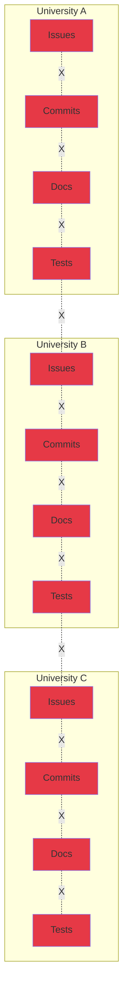

## The Problem: Knowledge is Fragmented, Even in Open Source

Universities building CubeSat programs face a critical challenge: **knowledge is scattered and siloed**, even when the technology is open source.

PROVES Kit and F Prime are open source platforms with extensive documentation. Yet teams still struggle to learn from each other's failures and successes because knowledge lives fragmented across:

- **Repos**: Issues, commits, tests, and docs are disconnected
- **Components**: Design decisions buried in code without context
- **Teams**: Each university solves the same problems in isolation
- **Time**: When students graduate, institutional knowledge leaves with them

**The result:** 88% of university CubeSat programs fail structurally, not technically. Knowledge exists, but it's not accessible when and where it's needed.

---

## The Current State: Knowledge Silos Prevent Learning

**Even AI can't help effectively** because knowledge is too fragmented to ingest meaningfully. Documentation exists, but it's scattered across hundreds of sources with no automated way to capture lessons learned.

---

## The Solution: Automated Knowledge Capture + Interrogatable Library

**PROVES Kit Agent** solves this through a two-part system:

### 1. Risk Scanning = Automated Knowledge Capture

**The breakthrough:** Risk scanning is the capture point. We create a reciprocal exchange:

- **PUSH knowledge to teams:** "Here's a mission-critical risk in your repo"
- **PULL knowledge from teams:** "Here's the context and fix"
- **Library grows automatically** through this exchange

Teams get immediate value (risk detection), while contributing to collective knowledge (context enrichment). No manual documentation required.

### 2. MCP Server = Interrogatable Memory for AI

**The game-changer:** An MCP (Model Context Protocol) server makes the library **interrogatable, not just searchable**.

Traditional approach: Dump docs into AI context windows
**Our approach:** Structured, queryable knowledge base that AI can interrogate intelligently

This creates **MEMORY** - a smart library that grows smarter with every team that uses it.

---

## How It Works: The Complete System

```mermaid
graph TB
    subgraph Capture
        Team1[University Team A]
        Team2[University Team B]
        Team3[University Team C]
        Scanner[Risk Scanner]
    end

    subgraph Process
        Curator[Agentic Curator]
        Review[Human Review]
    end

    subgraph Library
        Repo[Open Source Repo]
        MCP[MCP Server]
    end

    subgraph Access
        IDE[IDE Extensions]
        AI[AI Tools]
        Search[Search Interface]
    end

    Team1 <-->|Push/Pull| Scanner
    Team2 <-->|Push/Pull| Scanner
    Team3 <-->|Push/Pull| Scanner

    Scanner -->|Raw captures| Curator
    Curator -->|Normalized lessons| Review
    Review -->|Approved entries| Repo

    Repo -->|Indexes| MCP

    MCP --> IDE
    MCP --> AI
    MCP --> Search

    IDE -->|New risks found| Scanner

    style Scanner fill:#06d6a0
    style MCP fill:#118ab2
    style Repo fill:#073b4c
```

**The virtuous cycle:**

1. Teams scan repos for mission-critical risks
2. Scanner detects risks AND captures context/fixes
3. Curator normalizes lessons with citations
4. Human review approves entries
5. Library grows, making scanner smarter
6. All teams benefit from collective knowledge

---

## What This Enables

### For Universities Starting Space Programs

Access the collective knowledge of all PROVES Kit and F Prime missions. Interrogate the library to find:

- "What risks do first-time teams encounter with power systems?"
- "How did other teams solve radio communication timing issues?"
- "What testing patterns prevent mission-critical failures?"

### For Active Programs

- **Daily risk scanning** catches issues before they become critical
- **Automated capture** means no manual documentation burden
- **Shared learning** accelerates technology development across all programs

### For the Ecosystem

- Knowledge accumulates automatically through the push/pull loop
- Technology grows faster when failures and wins are captured and queryable
- New programs don't start from zero - they start from collective experience

---

## Three Layers of Knowledge

The library captures practical knowledge across three domains:

### Build Knowledge

- PROVES assembly and integration guides
- Hardware and subsystem references
- Flight software and testing procedures

### Software Architecture Knowledge

- F Prime architecture and component patterns
- Ports, components, and topologies
- Build system, tooling, and GDS usage

### Operational Knowledge

- Configurations and operational checklists
- Issue reports and verified fixes
- Test results and validation procedures

All curated with citations and artifact links. All interrogatable through MCP.

---

## Why This Works

### The incentive loop

- Teams get immediate value (risk detection and fixes)
- Library gets richer (context and lessons)
- AI gets smarter (structured, interrogatable knowledge)
- All teams benefit (collective learning)

### No manual work required

- Risk scanning happens as part of daily workflow
- Knowledge capture is automatic
- Curation is agent-assisted with human review

### Open source and transparent

- Library stored in open source repo
- Citations and excerpts (no proprietary data)
- Community-reviewed before inclusion

---

## Status

This repository is the concept documentation and research scrapbook. The working implementation (MCP server, risk scanner, curation agent) will live in a separate repository.

**Current phase:** Defining the architecture and knowledge capture mechanisms

---

## Learn More

- [Living Documentation Library](/proveskit-agent/living-library/) - How the library works
- [System Architecture](/proveskit-agent/architecture/) - Complete technical architecture with knowledge graphs, agents, and RAG
- [Technical Architecture](/proveskit-agent/technical/) - System design details
- [For Developers](/proveskit-agent/developers/) - How to use the tools
- [For Researchers](/proveskit-agent/researchers/) - Research questions and evaluation

---

## Contact

**Elizabeth Osborn** | Cal Poly Pomona
[eosborn@cpp.edu](mailto:eosborn@cpp.edu)
