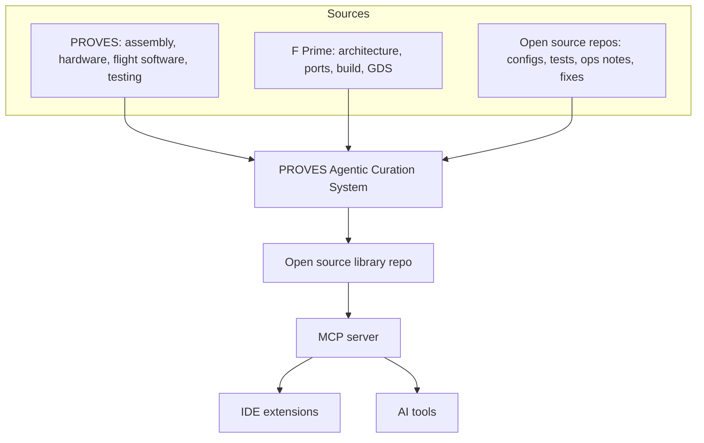

# Living Documentation Library and Repo Risk Assessment

**PROVES Kit Agent** is an open source, MCP-backed knowledge system focused on two things:

1) A living documentation library for deep research through MCP
2) A repo risk assessment extension that flags mission-critical issues in IDEs and links to fixes

---

## Why This Needs a Library You Can Interrogate

Right now the knowledge needed to build and operate these systems is fragmented:

- **Within a single repo**: design intent lives in issues, fixes live in commits, and tests live elsewhere.
- **Across teams**: each group solves the same problems in isolation.
- **Across sources**: PROVES hardware guidance, F Prime architecture, and operational fixes are in different places.
- **Across time**: decisions fade when people rotate or projects pause.

An interrogatable library turns that into one system instead of disconnected fragments.

## What It Does

| Capability | Description |
|------------|-------------|
| **Living Documentation** | MCP library with lessons, docs, and risk patterns linked to artifacts |
| **Risk Scan Extension** | IDE scan that flags likely mission-critical issues with fixes |

---

## How It Works

- Sources are indexed as citations and excerpts
- The PROVES Agentic Curation System normalizes entries and maintains citations
- Entries are reviewed before inclusion in the open source library
- The MCP server exposes the library for search and retrieval
- IDE extensions use risk patterns to scan repos

---

## Core Knowledge Sources

Think of the library as three layers of practical knowledge:

**1) Build the system**
- PROVES assembly and integration guides
- Hardware and subsystem references
- Flight software and testing notes

**2) Build the software**
- F Prime architecture and component model
- Ports, components, and topologies
- Build system, tooling, and GDS usage

**3) Operate and learn**
- Configs, tests, and operational checklists
- Issue reports and fixes (as citations and excerpts)
  
These layers are curated into one searchable library so the answers feel connected instead of scattered.

---

## Living Documentation Library

The library is the shared memory for users and projects. It is open source and stores:

- Lessons learned with links to artifacts
- Risk patterns and how to verify fixes
- Proven configuration guidance

[Living Documentation Library](https://lizo-roadtown.github.io/proveskit-agent/living-library/)

---

## Status

This repository is an open source scrapbook for the concept and documentation. The working implementation will live in a separate repository.

---

## Contact

**Elizabeth Osborn** | Cal Poly Pomona  
[eosborn@cpp.edu](mailto:eosborn@cpp.edu)
