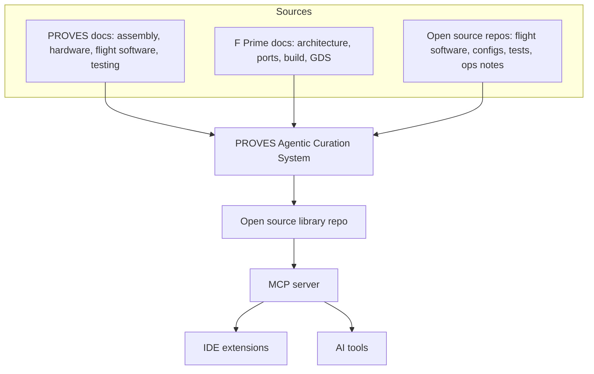

# Living Documentation Library and Repo Risk Assessment

**PROVES Kit Agent** is an open source, MCP-backed knowledge system focused on two things:

1) A living documentation library for deep research through MCP
2) A repo risk assessment extension that flags mission-critical issues in IDEs and links to fixes

## What It Does

| Capability | Description |
|------------|-------------|
| **Living Documentation** | MCP library with lessons, docs, and risk patterns linked to artifacts |
| **Risk Scan Extension** | IDE scan that flags likely mission-critical issues with fixes |

---

## How It Works

- Sources are indexed as citations and excerpts only
- The PROVES Agentic Curation System normalizes entries and maintains citations
- Entries are reviewed before inclusion in the open source library
- The MCP server exposes the library for search and retrieval
- IDE extensions use risk patterns to scan repos

---

## Core Knowledge Sources

**PROVES documentation:**
- Assembly and integration guides
- Hardware and subsystem references
- Flight software and testing notes
- Mission history and quick start

**F Prime documentation:**
- Architecture and component model
- Ports, components, and topologies
- Build system and tooling
- GDS usage and development process

**Open source repos:**
- Flight software, configs, and tests
- Operational checklists and procedures
- Issue reports and fixes (as citations and excerpts)

---

## Living Documentation Library

The library is the shared memory for users and projects. It is open source and stores:

- Lessons learned with links to artifacts
- Risk patterns and how to verify fixes
- Proven configuration guidance

[Living Documentation Library](https://lizo-roadtown.github.io/proveskit-agent/living-library/)

---

## Status

This repository is an open source scrapbook for the concept and documentation. The working implementation will live in a separate repository.

---

## Contact

**Elizabeth Osborn** | Cal Poly Pomona  
[eosborn@cpp.edu](mailto:eosborn@cpp.edu)
