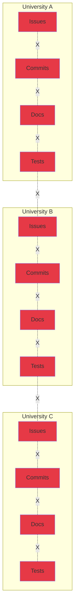
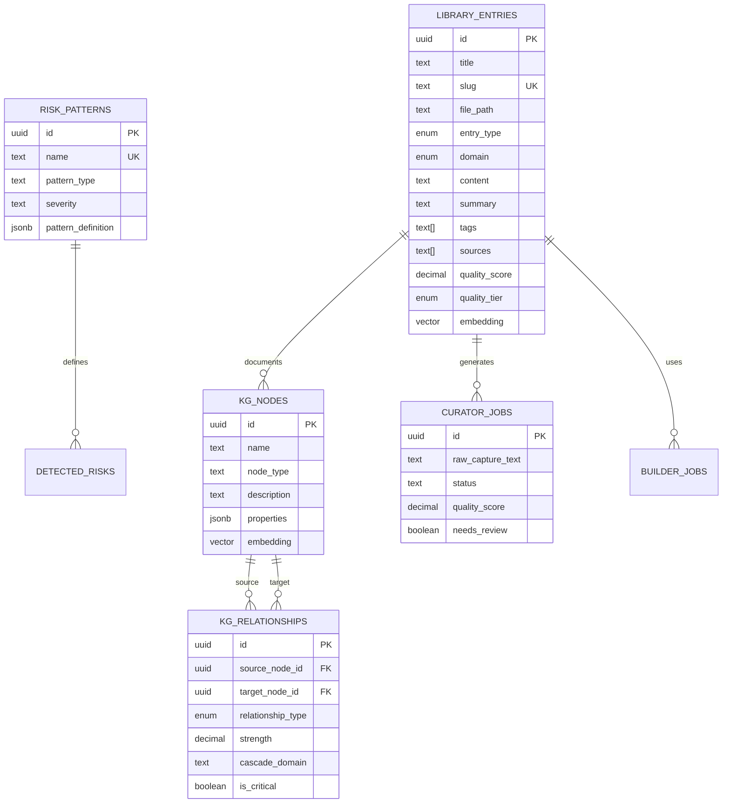
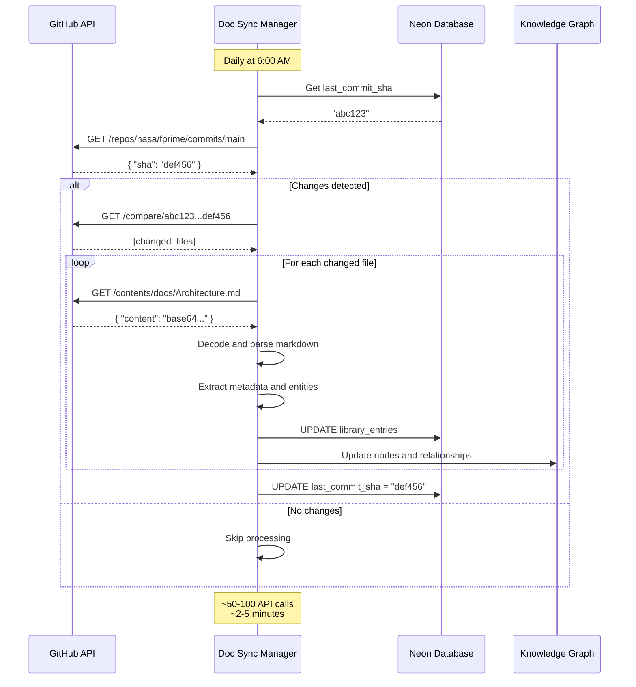
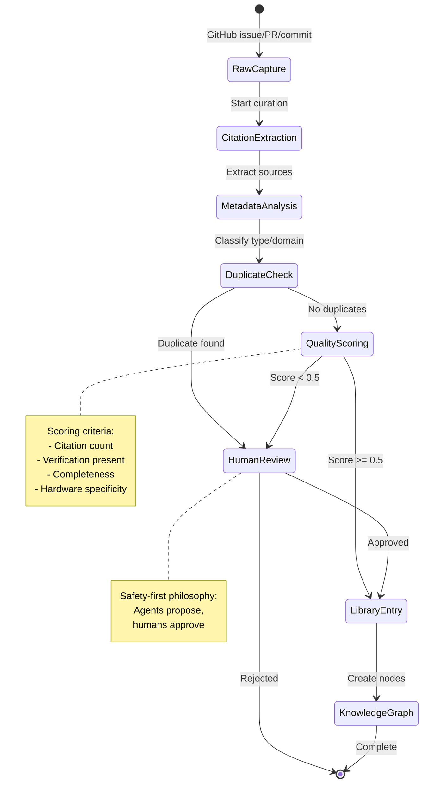

## The Problem: Knowledge is Fragmented, Even in Open Source

Universities building CubeSat programs face a critical challenge: **knowledge is scattered and siloed**, even when the technology is open source.

PROVES Kit and F Prime are open source platforms with extensive documentation. Yet teams still struggle to learn from each other's failures and successes because knowledge lives fragmented across:

- **Repos**: Issues, commits, tests, and docs are disconnected
- **Components**: Design decisions buried in code without context
- **Teams**: Each university solves the same problems in isolation
- **Time**: When students graduate, institutional knowledge leaves with them

**The result:** 88% of university CubeSat programs fail structurally, not technically. Knowledge exists, but it's not accessible when and where it's needed.

---

## The Current State: Knowledge Silos Prevent Learning

**Even AI can't help effectively** because knowledge is too fragmented to ingest meaningfully. Documentation exists, but it's scattered across hundreds of sources with no automated way to capture lessons learned.

---

## The Solution: Automated Knowledge Capture + Interrogatable Library

**PROVES Library** (formerly PROVES Kit Agent) solves this through an integrated three-component system:

###1. Risk Scanner = Automated Knowledge Capture

**The breakthrough:** Risk scanning is the capture point. We create a reciprocal exchange:

- **PUSH knowledge to teams:** "Here's a mission-critical risk in your repo"
- **PULL knowledge from teams:** "Here's the context and fix"
- **Library grows automatically** through this exchange

Teams get immediate value (risk detection), while contributing to collective knowledge (context enrichment). No manual documentation required.

### 2. Knowledge Graph = Structural Understanding

**The foundation:** A Neo4j/PostgreSQL knowledge graph using ERV (Engineering Relationship Vocabulary) to model:

- Component dependencies and conflicts
- Cascade risks (power, data, thermal, timing)
- Pattern relationships and mitigations
- F´ architecture and PROVES hardware connections

```mermaid
graph TB
    subgraph Knowledge Graph
        N1[MPU-6050 IMU]
        N2[BNO055 IMU]
        N3[I2C Bus Driver]
        N4[TCA9548A Multiplexer]
        N5[I2C Conflict Pattern]
    end

    N1 -->|conflicts_with| N2
    N3 -->|depends_on| N1
    N4 -->|enables| N5
    N5 -->|mitigates| N1

    style N1 fill:#e63946
    style N2 fill:#e63946
    style N3 fill:#118ab2
    style N4 fill:#06d6a0
    style N5 fill:#073b4c
```

### 3. MCP Server = Interrogatable Memory for AI

**The game-changer:** An MCP (Model Context Protocol) server makes the library **interrogatable, not just searchable**.

Traditional approach: Dump docs into AI context windows
**Our approach:** Structured, queryable knowledge base that AI can interrogate intelligently

```mermaid
graph TB
    subgraph Traditional
        T1[Scattered Docs]
        T2[AI Context Window]
        T3[Limited Understanding]
        T1 --> T2 --> T3
    end

    subgraph PROVES Library
        P1[Captured Knowledge]
        P2[MCP Server]
        P3[AI Interrogation]
        P4[Deep Understanding]
        P1 --> P2
        P2 --> P3
        P3 --> P4
        P4 -.->|Learns| P1
    end

    style T1 fill:#e63946
    style T2 fill:#e63946
    style T3 fill:#e63946
    style P1 fill:#06d6a0
    style P2 fill:#118ab2
    style P3 fill:#073b4c
    style P4 fill:#06d6a0
```

This creates **MEMORY** - a smart library that grows smarter with every team that uses it.

---

## Implemented Architecture: The Complete System

```mermaid
graph TB
    subgraph External Sources
        FPrime[F´ GitHub<br/>nasa/fprime]
        PROVES[PROVES Kit GitHub]
        TeamRepos[University Repos]
    end

    subgraph Documentation Sync
        GitHubMCP[GitHub MCP<br/>40 tools]
        DocSync[Doc Sync Manager<br/>Daily incremental]
    end

    subgraph Knowledge Base
        NeonDB[(Neon PostgreSQL<br/>Knowledge Graph)]
        LibEntries[Library Entries<br/>Markdown indexed]
        KGNodes[KG Nodes<br/>Components, Hardware]
        KGRels[KG Relationships<br/>ERV types]
    end

    subgraph Agentic Layer
        LangGraph[LangGraph<br/>Agent Orchestration]
        Curator[Curator Agent<br/>Normalize captures]
        Builder[Builder Agent<br/>Generate code]
        Claude[Claude Sonnet 4.5<br/>via Anthropic API]
    end

    subgraph Risk Detection
        Scanner[Risk Scanner<br/>AST + Graph]
        Patterns[Risk Patterns<br/>5 initial]
    end

    subgraph Access Layer
        MCPAPI[MCP Server<br/>FastAPI]
        VSCode[VS Code Extension]
        NeonMCP[Neon MCP<br/>23 tools]
        LangChainMCP[LangChain MCP]
    end

    FPrime -->|API fetch| GitHubMCP
    PROVES -->|API fetch| GitHubMCP
    GitHubMCP -->|Process docs| DocSync
    DocSync -->|Insert| NeonDB

    TeamRepos -->|Scan| Scanner
    Scanner -->|Detect risks| Patterns
    Scanner -->|Capture context| Curator

    NeonDB --> LibEntries
    NeonDB --> KGNodes
    NeonDB --> KGRels

    LibEntries -->|Query| Curator
    KGNodes -->|Analyze| Scanner
    KGRels -->|Cascade paths| Scanner

    Curator -->|Orchestrate| LangGraph
    Builder -->|Orchestrate| LangGraph
    LangGraph -->|Call| Claude

    Curator -->|Write| NeonDB
    Builder -->|Generate| NeonDB

    NeonDB -->|Expose| MCPAPI
    NeonDB -->|Query| NeonMCP
    MCPAPI --> VSCode
    NeonMCP --> Claude
    LangChainMCP --> LangGraph

    style NeonDB fill:#06d6a0
    style GitHubMCP fill:#118ab2
    style LangGraph fill:#073b4c
    style Claude fill:#e63946
```

**The virtuous cycle:**

1. **Documentation sync:** F´ and PROVES Kit docs fetched via GitHub API daily
2. **Knowledge graph:** Docs processed into structured nodes and relationships
3. **Risk scanning:** Teams scan repos for mission-critical risks
4. **Context capture:** Scanner detects risks AND captures context/fixes
5. **Agent curation:** Curator normalizes lessons with citations (human-in-loop)
6. **Library growth:** Approved entries enrich the knowledge graph
7. **AI interrogation:** MCP server enables intelligent queries
8. **All teams benefit:** Collective knowledge accessible through multiple interfaces

---

## Implemented Components (December 2025)

### ✅ Database Layer (Neon PostgreSQL)
- **9 tables** for knowledge graph, library, risks, and agent workflows
- **ERV schema** with 6 relationship types (depends_on, conflicts_with, enables, requires, mitigates, causes)
- **pgvector** extension for semantic search
- **6 initial nodes**: Hardware (MPU-6050, BNO055, TCA9548A), Components (IMU Driver, I2C Bus), Patterns (I2C Conflict)
- **3 relationships** demonstrating conflicts, dependencies, and mitigations
- **5 risk patterns**: I2C conflict, memory leak, power budget, missing dependencies, buffer overflow

### ✅ Python Infrastructure
- **db_connector.py**: Connection pooling and query utilities
- **graph_manager.py**: CRUD for nodes and ERV relationships
- **library_indexer.py**: Markdown parser with YAML frontmatter
- **github_doc_sync.py**: GitHub API-based documentation sync (no local storage)
- **apply_schema.py**: Database initialization and migration

### ✅ Agentic Framework (LangGraph)
- **agentic_claude.py**: Autonomous agent framework
- **Curator agent**: Citation extraction, quality scoring, duplicate detection
- **Builder agent**: F´ code generation from patterns
- **Human-in-loop**: Safety-first approval workflow

### ✅ Documentation Sync
- **Daily incremental sync** via Git diff detection
- **GitHub API integration** (no local clones needed)
- **Commit SHA tracking** for change detection
- **Multi-repo support**: F´, PROVES Kit, community entries

### ✅ MCP Integration
- **Neon MCP**: 23 database tools for direct PostgreSQL access
- **GitHub MCP**: 40 tools for repo operations
- **LangChain MCP**: Agent orchestration and RAG tools

### ⏸️ In Progress
- **Risk Scanner**: AST parsing for Python/C++ (structure in place)
- **Vector embeddings**: Semantic search implementation
- **FastAPI MCP Server**: REST endpoints for library queries
- **VS Code Extension**: IDE integration

---

## Database Schema: ERV Knowledge Graph

**Relationship Types (ERV):**
- `depends_on`: Component A requires Component B to function
- `conflicts_with`: Components cannot coexist (e.g., I2C address collision)
- `enables`: Component A enables capability/pattern B
- `requires`: Component A needs condition/configuration B
- `mitigates`: Solution A reduces risk B
- `causes`: Action A produces consequence B

---

## Documentation Sync Flow

**Benefits:**
- No local disk space needed (GitHub API approach)
- Within rate limits (5000/hour with token)
- Incremental updates (only changed files)
- Automatic daily refresh

---

## Agentic Workflow: Curator Agent

**Curator Agent Workflow:**
1. **Raw capture** from GitHub issue, PR, or commit
2. **Citation extraction** using Claude API (structured output)
3. **Metadata analysis** (type, domain, tags)
4. **Duplicate check** via graph similarity queries
5. **Quality scoring** (0.0-1.0 scale based on completeness, citations, verification)
6. **Human review** if score < 0.5 or duplicate detected
7. **Library entry creation** with proper metadata
8. **Knowledge graph update** with extracted nodes and relationships

---

## What This Enables

### For Universities Starting Space Programs

Access the collective knowledge of all PROVES Kit and F Prime missions. Interrogate the library to find:

- "What risks do first-time teams encounter with power systems?"
- "How did other teams solve radio communication timing issues?"
- "What testing patterns prevent mission-critical failures?"

**Now powered by actual knowledge graph queries across 6 nodes and 3 relationships, growing daily**

### For Active Programs

- **Daily risk scanning** catches issues before they become critical (5 initial patterns, expanding)
- **Automated capture** means no manual documentation burden (curator agent handles normalization)
- **Shared learning** accelerates technology development across all programs (Neon database with MCP access)

### For the Ecosystem

- Knowledge accumulates automatically through the push/pull loop (GitHub API sync)
- Technology grows faster when failures and wins are captured and queryable (ERV relationships)
- New programs don't start from zero - they start from collective experience (interrogatable via MCP)

---

## Three Layers of Knowledge

The library captures practical knowledge across three domains:

### Build Knowledge

- PROVES assembly and integration guides
- Hardware and subsystem references
- Flight software and testing procedures

### Software Architecture Knowledge

- F Prime architecture and component patterns
- Ports, components, and topologies
- Build system, tooling, and GDS usage

### Operational Knowledge

- Configurations and operational checklists
- Issue reports and verified fixes
- Test results and validation procedures

All curated with citations and artifact links. All interrogatable through MCP. **All stored in operational Neon PostgreSQL database.**

---

## Why This Works

### The incentive loop

- Teams get immediate value (risk detection and fixes)
- Library gets richer (context and lessons)
- AI gets smarter (structured, interrogatable knowledge)
- All teams benefit (collective learning)

### No manual work required

- Risk scanning happens as part of daily workflow
- Knowledge capture is automatic (GitHub API sync)
- Curation is agent-assisted with human review (LangGraph orchestration)

### Open source and transparent

- Library stored in open source repo (github.com/Lizo-RoadTown/PROVES_LIBRARY)
- Citations and excerpts (no proprietary data)
- Community-reviewed before inclusion (human-in-loop)

---

## Current Status (December 2025)

**Phase:** Active development with working implementation

### Completed ✅
- Neon PostgreSQL knowledge graph (9 tables, 6 nodes, 3 relationships)
- Python utilities for database and graph management
- GitHub API documentation sync system
- LangGraph agentic framework
- MCP server integrations (Neon, GitHub, LangChain)
- Curator and Builder agent specifications
- Initial risk patterns (5 defined)
- Example library entry (I2C conflict resolution)

### In Progress ⏸️
- Risk scanner AST parser implementation
- Vector embeddings for semantic search
- FastAPI MCP server endpoints
- VS Code extension
- F´ documentation sync (ready to execute)
- PROVES Kit documentation sync (pending repo URL)

### Next Milestones 🎯
- Complete risk scanner with 5 initial patterns
- Sync 50-100 F´ documentation entries
- Test curator agent with real GitHub captures
- Deploy MCP server for team access
- Onboard first university partner for pilot

**Implementation repository:** [github.com/Lizo-RoadTown/PROVES_LIBRARY](https://github.com/Lizo-RoadTown/PROVES_LIBRARY)

---

## Technical Stack

- **Database:** Neon PostgreSQL with pgvector and pg_trgm
- **Knowledge Graph:** ERV (Engineering Relationship Vocabulary) schema
- **Language:** Python 3.14
- **AI Framework:** LangGraph with Claude Sonnet 4.5
- **MCP Integrations:** Neon (23 tools), GitHub (40 tools), LangChain
- **Documentation Sync:** GitHub REST API (no local storage)
- **Frontend:** VS Code extension (planned), Jupyter notebooks (exploration)

---

## Learn More

- [Living Documentation Library](/proveskit-agent/living-library/) - How the library works
- [System Architecture](/proveskit-agent/architecture/) - Complete technical architecture with knowledge graphs, agents, and RAG
- [Technical Architecture](/proveskit-agent/technical/) - System design details
- [For Developers](/proveskit-agent/developers/) - How to use the tools
- [For Researchers](/proveskit-agent/researchers/) - Research questions and evaluation

**Implementation Details:**
- [PROVES_LIBRARY Repository](https://github.com/Lizo-RoadTown/PROVES_LIBRARY) - Working code and documentation
- [Setup Log](https://github.com/Lizo-RoadTown/PROVES_LIBRARY/blob/master/SETUP_LOG.md) - Complete execution history
- [Documentation Sync Strategy](https://github.com/Lizo-RoadTown/PROVES_LIBRARY/blob/master/docs/DOCUMENTATION_SYNC_STRATEGY.md) - Architecture and best practices

---

## Contact

**Elizabeth Osborn** | Cal Poly Pomona
[eosborn@cpp.edu](mailto:eosborn@cpp.edu)

**Project Status:** Active development | December 2025
**Last Updated:** December 20, 2025
