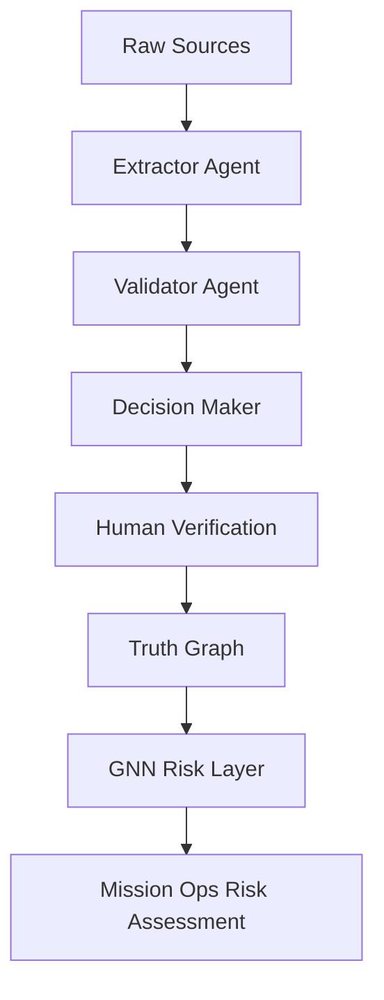
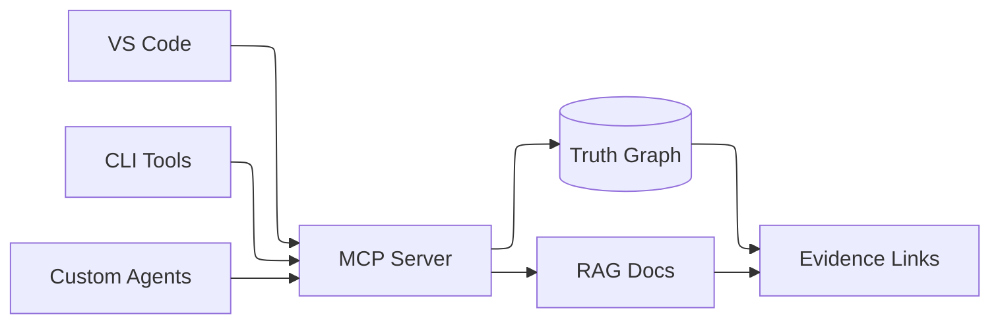
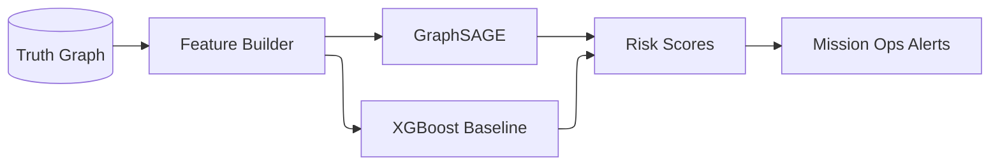

# PROVES Kit Agent: Agentic Knowledge Capture for CubeSat Missions

PROVES Kit Agent is the public-facing agentic system that powers the PROVES Library knowledge graph for CubeSat teams. It captures hidden dependencies from documentation, routes them through human verification, and exposes a queryable truth graph through MCP.

---

## The Problem

University missions fail for organizational reasons more often than technical ones:

- Knowledge is fragmented across docs, repos, and graduating cohorts
- Cross-system dependencies stay hidden until late integration
- Teams repeat the same failures without shared institutional memory

---

## What It Does Today

- **Curator agent** extracts dependencies from F Prime and PROVES Kit docs
- **LangGraph orchestration** coordinates extractor, validator, and storage sub-agents
- **Truth layer gating** ensures only human-verified data enters the graph
- **Neon knowledge graph** stores ERV relationships with evidence and lineage
- **MCP server** exposes the graph and docs to VS Code, CLI, and other agents

---

## MCP Server: The Interface CubeSat Teams Use

The MCP server is the single query interface to the knowledge graph and documentation RAG layer. It enables:

- Graph queries and cascade analysis for cross-system risks
- Evidence tracing for every dependency claim
- Tooling integrations (VS Code, CLI, custom agents)

---

## GNN Risk Layer (Proves_AI)

The truth graph is the training substrate for a graph neural network risk model:

- GraphSAGE for cascade and graph risk scoring
- XGBoost baseline for mission success prediction
- Cross-encoder reranker for retrieval quality

See the scaffold repo: https://github.com/Lizo-RoadTown/Proves_AI

---

## Explore the System

- System architecture: /proveskit-agent/architecture/
- Technical details: /proveskit-agent/technical/
- For developers: /proveskit-agent/developers/
- For researchers: /proveskit-agent/researchers/
- Implementation repo: https://github.com/Lizo-RoadTown/PROVES_LIBRARY

---

## Status

- **Trial mapping complete:** 45+ dependencies from F Prime I2C and PROVES power docs
- **Infrastructure complete:** Neon graph schema + LangGraph checkpointer
- **Curator agent active:** sub-agent workflow and HITL verification
- **GNN pipeline started:** Proves_AI scaffold in progress

---

## Contact

**Elizabeth Osborn** | Cal Poly Pomona  
[eosborn@cpp.edu](mailto:eosborn@cpp.edu)
