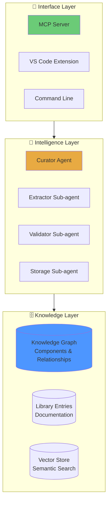
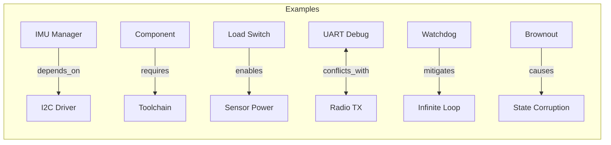
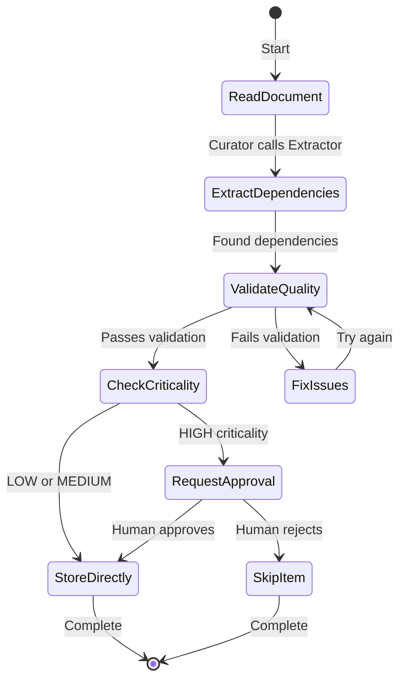
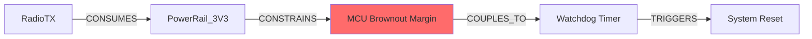
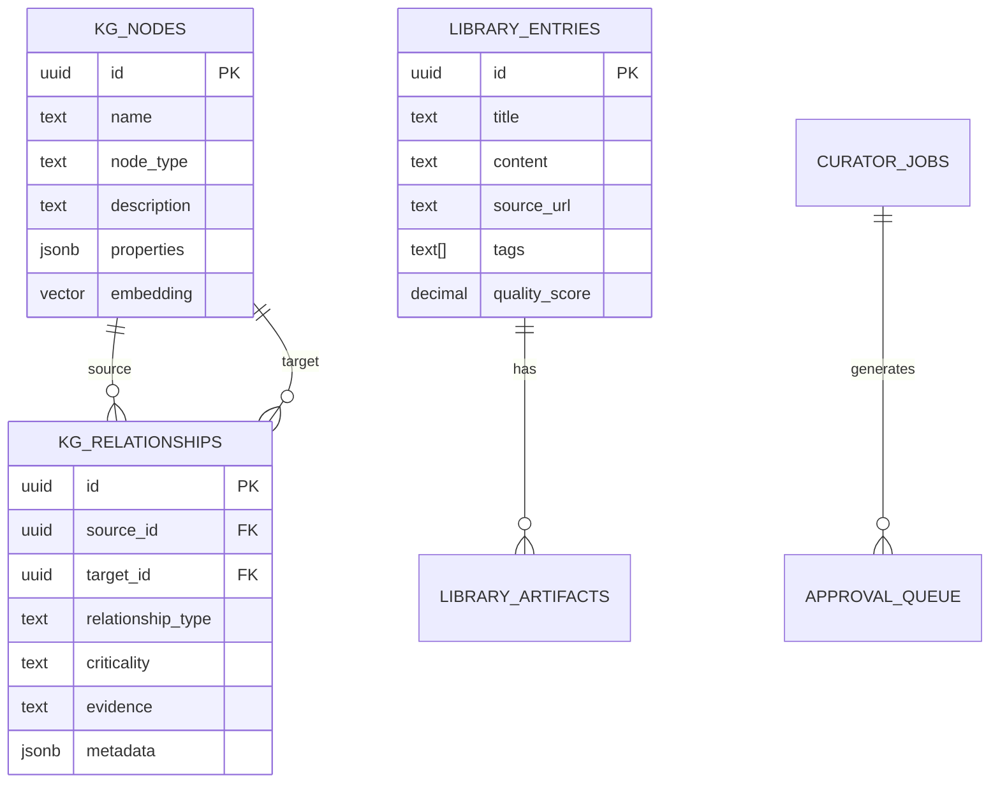

[← Back to Home](/proveskit-agent/)

# System Architecture: How PROVES Library Works

This page explains how the PROVES Library system is built — from AI agents to knowledge graphs to the tools that make it all accessible.

---

## The Big Picture

Think of PROVES Library as three layers working together:



| Layer | What It Does | Key Technologies |
|-------|--------------|------------------|
| **Knowledge** | Stores relationships and content | PostgreSQL, pgvector, ERV schema |
| **Intelligence** | Extracts and validates information | LangGraph, Claude Sonnet/Haiku |
| **Interface** | Provides access to knowledge | MCP Server, VS Code, CLI |

---

## Layer 1: The Knowledge Graph

### Why a Graph?

Traditional documentation is flat — you search for keywords and hope to find what you need. A knowledge graph is different: it stores **relationships** between things.

**Example:** If you ask "What breaks when I modify the I2C driver?"

- **Flat docs:** Search for "I2C" → get a list of documents
- **Knowledge graph:** Query relationships → get a list of components that depend on I2C driver

### The ERV Schema

ERV (Engineering Relationship Vocabulary) defines 6 types of relationships:



| Relationship | When to Use | Example |
|--------------|-------------|---------|
| `depends_on` | A needs B to work at runtime | ImuManager → LinuxI2cDriver |
| `requires` | A needs B to build/compile | Component → Toolchain |
| `enables` | A makes B possible | LoadSwitch → SensorPower |
| `conflicts_with` | A and B can't coexist | UARTDebug ↔ RadioTX (same pins) |
| `mitigates` | A reduces the risk of B | WatchdogTimer → InfiniteLoop |
| `causes` | A leads to B happening | PowerBrownout → StateCorruption |

### What Gets Stored

The database has 9 tables organized into three groups:

**Knowledge Graph Tables:**
- `kg_nodes` — Components, hardware, patterns
- `kg_relationships` — ERV-typed edges with metadata

**Library Tables:**
- `library_entries` — Processed documentation with citations
- `library_artifacts` — Links to source files and repos

**Agent Workflow Tables:**
- `curator_jobs` — Extraction tasks in progress
- `approval_queue` — Items waiting for human review
- `checkpoints` — LangGraph agent state snapshots

---

## Layer 2: The AI Agents

### Why LangGraph?

Simple AI tasks can use a single prompt. Complex tasks need **multi-step reasoning** with decisions at each step. LangGraph provides a state machine for building these workflows.

### The Sub-Agents-as-Tools Pattern

Instead of one giant agent doing everything, we use specialized sub-agents:

```
┌─────────────────────────────────────────────────────────────┐
│  CURATOR AGENT (Claude Sonnet 4.5)                          │
│  - Coordinates the workflow                                 │
│  - Decides which sub-agent to call                          │
│  - Requests human approval when needed                      │
└───────┬──────────────┬──────────────┬──────────────────────┘
        │              │              │
        ▼              ▼              ▼
┌───────────┐  ┌──────────┐  ┌──────────────┐
│ EXTRACTOR │  │VALIDATOR │  │   STORAGE    │
│(Sonnet 4.5)│  │(Haiku 3.5)│  │ (Haiku 3.5)  │
│           │  │           │  │              │
│ Reads docs│  │ Checks    │  │ Saves to     │
│ finds deps│  │ quality   │  │ database     │
└───────────┘  └──────────┘  └──────────────┘
```

**Why this pattern?**

| Benefit | Explanation |
|---------|-------------|
| **Cost savings** | Haiku is 90% cheaper than Sonnet — use it for simple tasks |
| **Context isolation** | Each agent only sees what it needs |
| **Easier debugging** | Problems are localized to one sub-agent |
| **Parallel execution** | Sub-agents can run simultaneously |

### The Extraction Workflow



### Criticality Levels

| Level | Meaning | Human Review? |
|-------|---------|---------------|
| **HIGH** | Mission-critical dependency | ✅ Required |
| **MEDIUM** | Important but not fatal | ❌ Automatic |
| **LOW** | Minor impact if wrong | ❌ Automatic |

**Example of HIGH criticality:**
```
LinuxI2cDriver → LinuxGpioDriver (depends_on)
Reason: If the GPIO reset line fails, the I2C bus hangs permanently.
        No recovery without hardware power cycle.
```

---

## Layer 3: Interfaces

### MCP Server (Planned)

Model Context Protocol (MCP) is an open standard for AI tools to access external resources. The PROVES Library MCP server will expose:

```python
# Planned endpoints
POST /search              # Semantic + keyword search
GET  /entry/{id}         # Fetch specific entry
GET  /list               # Browse by category
GET  /artifacts/{id}     # Get linked artifacts

# Knowledge graph queries
POST /graph/query        # Query relationships
POST /graph/cascade      # Find propagation paths
GET  /graph/node/{id}    # Get node details
```

**Why MCP?**
- Works with VS Code Copilot, Cursor, and other AI-enabled IDEs
- Vendor-neutral — not locked to one AI provider
- Standardized — same interface everywhere

### VS Code Extension (Planned)

The extension will provide:
- Real-time risk scanning as you code
- Inline warnings when modifying risky components
- Quick links to relevant library entries
- One-click submission of new knowledge

### Command Line Tools

Current Python scripts for direct access:

```bash
# Run the curator agent
python curator-agent/run_with_approval.py

# Apply database schema
python scripts/apply_schema.py

# Manage the knowledge graph
python scripts/graph_manager.py
```

---

## How Queries Work

**User question:** "Why might my radio cause system resets?"

### Step 1: Query Classification

The system determines this is a **cascade analysis** question — we need to find propagation paths through shared resources.

### Step 2: Graph Query

```sql
-- Find paths from Radio to SystemReset
SELECT path FROM kg_relationships
WHERE source_type = 'RadioComponent'
  AND connects_to('SystemReset', max_depth=5)
  AND resource_type IN ('power', 'timing');
```

### Step 3: Path Analysis



**Finding:** Edge 3 (MCU → Watchdog) is marked "assumed" — no test data confirms the brownout threshold triggers the watchdog.

### Step 4: Response

> Your radio may cause resets through this cascade:
> 1. RadioTX draws high current during transmission
> 2. Power rail voltage drops below brownout threshold
> 3. MCU brownout detector triggers (⚠️ assumed, not tested)
> 4. Watchdog interprets brownout as hang → reset
>
> **Recommended tests:**
> - Monitor power rail with oscilloscope during TX
> - Verify brownout threshold in fuse bits
>
> **Similar resolved issues:** software-023, build-015

---

## Database Schema



---

## Security & Privacy

### What We Store

- ✅ Citations and excerpts from public documentation
- ✅ Relationship metadata extracted by agents
- ✅ Links to source artifacts (repos, files, lines)
- ❌ No proprietary code
- ❌ No personal information
- ❌ No mission-specific secrets

### Access Control

- API authentication with keys
- Rate limiting per user
- Audit logging for all modifications
- Human approval for HIGH criticality items

---

## What's Next?

| Component | Status | Description |
|-----------|--------|-------------|
| Curator Agent | 🔄 In Development | Dependency extraction from docs |
| Knowledge Graph | ✅ Complete | PostgreSQL + ERV schema |
| MCP Server | 📋 Planned | Query interface for AI tools |
| Risk Scanner | 📋 Planned | Scan repos for risk patterns |
| VS Code Extension | 📋 Planned | IDE integration |

---

## Learn More

- **[PROVES_LIBRARY Repository](https://github.com/Lizo-RoadTown/PROVES_LIBRARY)** — Working code
- **[GETTING_STARTED.md](https://github.com/Lizo-RoadTown/PROVES_LIBRARY/blob/master/GETTING_STARTED.md)** — Set up in 15 minutes
- **[CANON.md](https://github.com/Lizo-RoadTown/PROVES_LIBRARY/blob/master/CANON.md)** — Core design principles
- **[AGENTIC_ARCHITECTURE.md](https://github.com/Lizo-RoadTown/PROVES_LIBRARY/blob/master/docs/AGENTIC_ARCHITECTURE.md)** — Deep agent design

[← Back to Home](/proveskit-agent/)
