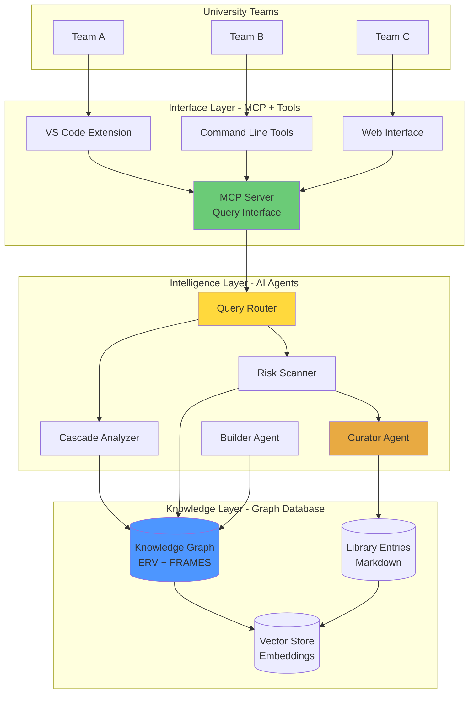
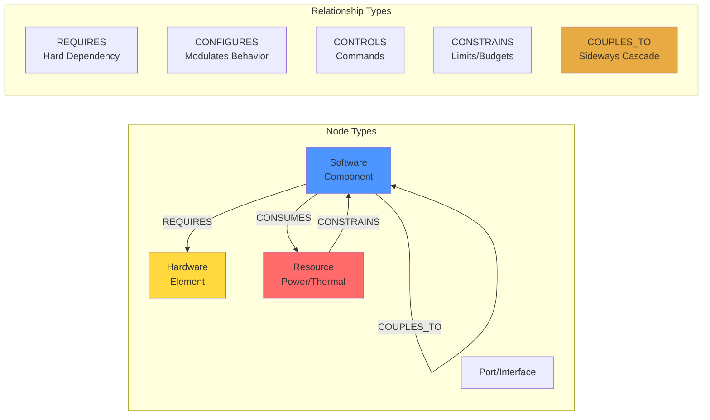
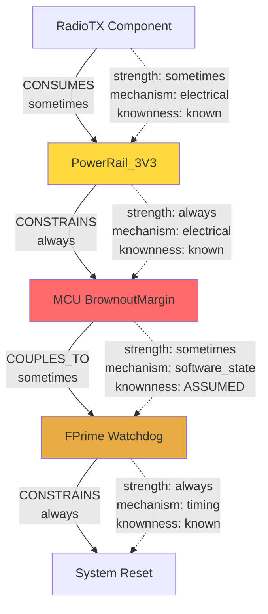
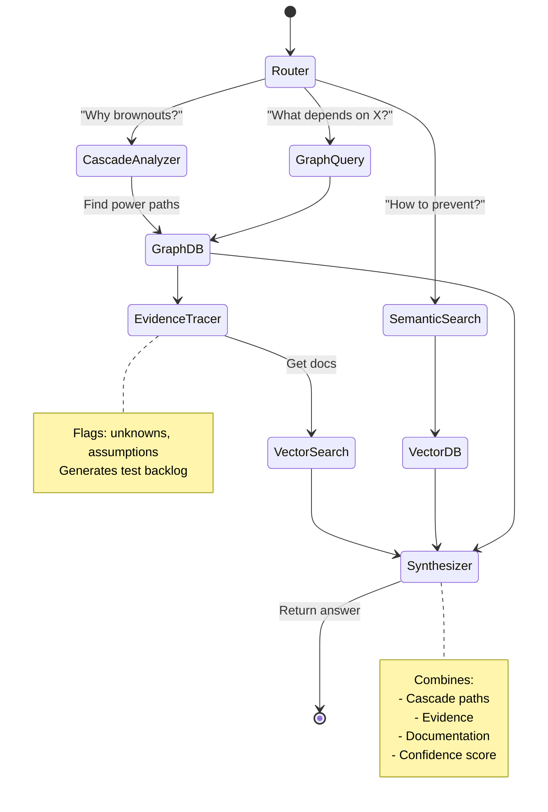
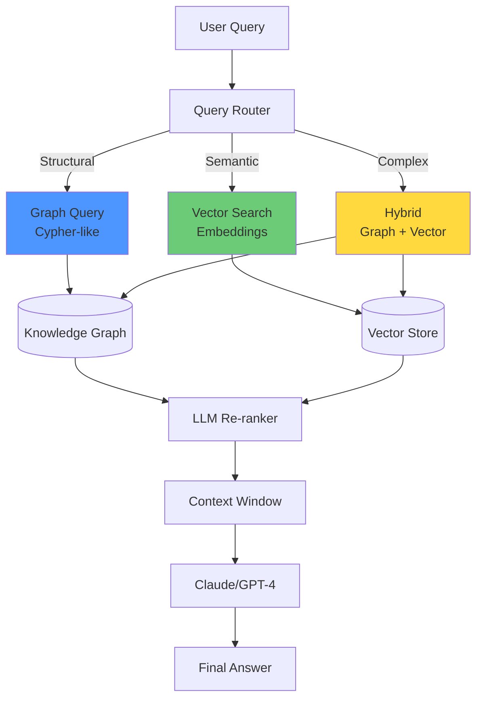

[← Back to Home](/proveskit-agent/)

# PROVES Kit Agent: Complete System Architecture

This page provides a comprehensive technical overview of the PROVES Kit Agent system, showing how knowledge graph technology, autonomous agents, and hybrid RAG systems work together to create an interrogatable memory for CubeSat missions.

---

## Overview: Three-Layer Architecture



**The three layers work together:**

1. **Knowledge Layer** stores relationships (graph), content (markdown), and semantics (vectors)
2. **Intelligence Layer** uses LangGraph agents to reason over the knowledge
3. **Interface Layer** provides MCP-based access for all tools and IDEs

---

## Layer 1: Knowledge Graph with Engineering Semantics

### The Problem: Not All Relationships Are Equal

Traditional documentation treats all relationships the same. But in real systems:
- Some dependencies are **always** required (software needs hardware)
- Some effects are **sometimes** present (power noise affects ADC in high-TX mode)
- Some mappings are **never** true (component X removed in version 2.0)

We need a way to model **always/sometimes/never** with full traceability.

### The Solution: Engineering Relationship Vocabulary (ERV)



**Every edge has 5 critical attributes:**

```yaml
directionality:   Does A→B? Does B→A? Both?
strength:         Always | Sometimes | Never
mechanism:        electrical | thermal | timing | protocol | resource | software_state
knownness:        Known | Assumed | Unknown | Disproved
scope:            version_tuple, hardware_revision, mission_profile, conditions
```

### Example: Power Cascade Modeling

**The question:** "Why does my radio cause system resets?"

**Traditional approach:** Search docs for "radio" + "reset" → hope to find answer

**Our approach:** Query the knowledge graph for cascade paths



**The system returns:**

Path: RadioTX → PowerRail_3V3 → MCU_Brownout → Watchdog → Reset

**Evidence gap:** Edge 3 (MCU→Watchdog) marked "assumed" - no scope data confirming brownout threshold → watchdog timing

**Recommended actions:**
1. Add bulk capacitor on PowerRail_3V3 (470μF minimum)
2. Test: Monitor power rail during TX with oscilloscope
3. Verify: Brownout threshold in fuse bits

**Similar resolved issues:** software-023, build-015

---

## Layer 2: LangGraph Agent Orchestration

### Why LangGraph?

Complex queries require **multi-step reasoning**:
- Route query to right analyzer (cascade? semantic? hybrid?)
- Execute graph queries
- Trace evidence chains
- Retrieve relevant documentation
- Synthesize final answer

LangGraph provides a state machine for agent workflows.

### Agent Workflow Example



### The Deep Agents

**1. Cascade Analyzer Agent**

Specialized in finding propagation paths through resources (power, thermal, timing).

```python
Tools available:
- GraphCascadeQuery: Find paths through resources
- GetEdgeDetails: Retrieve 5 attributes for each edge
- CheckEvidence: Trace evidence for claims
- CalculateRisk: Score cascade based on unknowns
```

**2. Scanner Agent (Enhanced with Graph Reasoning)**

Traditional risk scanning + graph-powered dependency checking.

```python
Capabilities:
- Pattern matching (AST, config analysis)
- Graph querying (missing REQUIRES edges)
- Cascade risk detection (coupled components via shared resources)
- Version tuple validation
```

**3. Curator Agent**

Normalizes raw knowledge captures into structured library entries.

```python
Tasks:
- Extract citations from sources
- Suggest tags based on content
- Detect duplicates (semantic similarity)
- Score entry quality (0-1)
- Learn from approval/rejection patterns
```

**4. Builder Agent (FRAMES-Aware)**

Generates F´ components matched to team constraints (bounded rationality).

```python
Adapts to:
- Team experience level (beginner → simpler code)
- Time pressure (deadline → reference implementation)
- Hardware constraints (available test equipment)

Optimizes for:
- Interface strength (FRAMES dimensions)
- Near-decomposability (weak external coupling)
```

---

## Layer 3: Hybrid RAG (Graph + Vector)

### The Problem with Pure Vector Search

Vector embeddings are great for semantic similarity but terrible for structural queries:

- ✅ "How do I prevent brownouts?" → Find docs on power management
- ❌ "Show all components that depend on I2C_Bus" → Can't traverse dependencies

### The Problem with Pure Graph Queries

Graph databases excel at relationships but miss semantic nuance:

- ✅ "Find all REQUIRES edges" → Perfect graph query
- ❌ "What's the best practice for...?" → No semantic understanding

### Our Solution: Intelligent Query Routing



**Query classification:**

| Query Type | Example | Route To |
|-----------|---------|----------|
| Structural | "What depends on I2C_Bus?" | Graph |
| Semantic | "How to prevent brownouts?" | Vector |
| Causal | "Why does radio cause resets?" | Hybrid (cascade path + mitigation docs) |

---

## Integration with FRAMES Ontology

PROVES Kit Agent integrates organizational theory (FRAMES) with technical causality (ERV).

### FRAMES Principles Applied

**1. Bounded Rationality → Satisficing Code Generation**

University teams don't optimize - they satisfice under constraints.

Builder agent generates code matched to:
- Team experience (beginner → heavily commented)
- Time pressure (2 weeks to CDR → battle-tested reference impl)
- Resources (no oscilloscope → simpler power design)

**2. Near-Decomposability → Topology Analysis**

Healthy systems: strong internal coupling, weak external coupling.

Scanner detects violations:
```python
if external_coupling > internal_coupling:
    flag_risk("Subsystem too tightly coupled to external components")
```

**3. Interface Strength → 6 Dimensions**

ERV edges → FRAMES interface strength:
- Frequency (from CONTROLS/CONFIGURES edges)
- Reciprocity (from bidirectional flag)
- Bandwidth (from message size in ports)
- Latency (from timing mechanism)
- Error recovery (from VERIFIED_BY edges)
- Shared outcomes (from REQUIRES/CONSTRAINS)

**4. Digital Traces → Problem-Solving Modules**

Git commits → Structured problem-solving narratives:
- Problem framing (initial commits)
- Exploration (commits trying different approaches)
- Dead ends (reverted commits)
- Breakthrough (successful strategy)
- Validation (test commits)

Not just "what worked" but **"how they figured it out"**.

---

## The Six Sweeps: Automated Validation

The system runs six types of sweeps to maintain knowledge integrity:

### 1. Identity Integrity Sweep

**Goal:** Ensure IDENTICAL/ALIAS/EQUIVALENT claims are justified

**Checks:**
- All identity edges have `knownness: known` with evidence
- Version tuples match current context
- No ambiguous mappings

### 2. Asymmetry Check Sweep

**Goal:** Verify directionality makes engineering sense

**Checks:**
- REQUIRES edges are usually unidirectional
- COUPLES_TO edges should be bidirectional
- Flag suspicious patterns

### 3. Cascade Path Analysis Sweep ⭐

**Goal:** Trace propagation through resources

**Output:** All paths from component X through resource type Y
- Strength of each edge (always/sometimes)
- Mechanisms involved
- Unknown/assumed edges flagged
- Risk score computed

### 4. Unknown Edge Backlog Sweep

**Goal:** Auto-generate test queue

**Output:** Ranked list of edges needing verification
- Priority based on criticality + cascade depth
- Recommended tests (oscilloscope, code review, integration test)

### 5. Version Tuple Conflicts Sweep

**Goal:** Catch "works in v1, breaks in v2"

**Checks:**
- Edge scope matches current repo versions
- Flag edges marked `strength: always` with mismatched scope

### 6. Contract vs Implementation Drift Sweep

**Goal:** Detect when implementations diverge from contracts

**Calculates drift score (0-1):**
- Signature match
- Behavior match (from tests)
- Parameter match
- Documentation match

---

## Example: Complete Query Flow

**User:** "Why does my radio cause system resets during transmission?"

### Step 1: Router Classification
```
Type: Cascade analysis
Component: RadioTX
Symptom: system_resets
Trigger: transmission
```

### Step 2: Cascade Analyzer Query
```cypher
MATCH p=(start {id: 'RadioTX_Component'})-[*1..6]->(end {id: 'SystemReset'})
WHERE ALL(r IN relationships(p) WHERE r.relation IN ['CONSUMES', 'CONSTRAINS', 'COUPLES_TO'])
RETURN p
```

### Step 3: Results
Path found: RadioTX → PowerRail_3V3 → MCU_Brownout → Watchdog → Reset

### Step 4: Evidence Tracer
```
Edge 1: RadioTX CONSUMES PowerRail_3V3
  - Evidence: Schematic section 4, power budget spreadsheet
  - Knownness: Known

Edge 2: PowerRail_3V3 CONSTRAINS MCU_BrownoutMargin
  - Evidence: Datasheet pg 42, fuse bit configuration
  - Knownness: Known

Edge 3: MCU_Brownout COUPLES_TO Watchdog
  - Evidence: NONE ← Gap found
  - Knownness: Assumed

Edge 4: Watchdog CONSTRAINS SystemReset
  - Evidence: F´ watchdog component code
  - Knownness: Known
```

### Step 5: Vector Search
Retrieve docs on:
- "F´ watchdog reset behavior"
- "brownout detection best practices"
- "power supply decoupling for radio systems"

### Step 6: Synthesizer
```markdown
**Answer:**

Your radio causes resets through this cascade:

1. RadioTX draws high current during transmission (CONSUMES PowerRail_3V3)
2. Power rail voltage drops below 3.2V (CONSTRAINS MCU_BrownoutMargin)
3. MCU brownout detector triggers (COUPLES_TO Watchdog) ← **ASSUMED**
4. F´ watchdog interprets as hang and resets system

**Evidence gap:** Step 3 marked "assumed" - no scope data confirming brownout→watchdog timing.

**Recommended actions:**
1. Add 470μF bulk capacitor on PowerRail_3V3
2. Reduce RadioTX duty cycle below 50%
3. Test: Monitor power rail with oscilloscope during TX
4. Verify: Brownout threshold correctly set in fuse bits

**Similar issues resolved:**
- software-023: Radio brownout mitigation
- build-015: Power supply sizing for RF

**Confidence:** 0.75 (lower due to assumed link at step 3)
```

---

## Technology Stack

### Knowledge Layer
- **Graph Database:** Neo4j or PostgreSQL + Apache AGE
- **Vector Store:** Chroma (embedded) or Pinecone (hosted)
- **Document Storage:** Markdown files in Git
- **Metadata Index:** SQLite

### Intelligence Layer
- **Agent Framework:** LangGraph (state machine for multi-step reasoning)
- **Agent Library:** LangChain (tools, prompts, memory)
- **LLM:** Claude Sonnet 4.5 (primary), GPT-4 (fallback), local models (simple tasks)
- **Embeddings:** sentence-transformers (all-MiniLM-L6-v2)

### Interface Layer
- **API Server:** FastAPI (Python)
- **Protocol:** MCP (Model Context Protocol) - vendor-neutral
- **VS Code Extension:** TypeScript
- **CLI Tools:** Click (Python)

---

## Performance & Scalability

### Current Scale (Phase 1-2)
- 100-500 nodes in graph
- 50-100 library entries
- 3-5 university teams
- ~1,000 queries/day

### Production Scale (Phase 5)
- 10,000+ nodes
- 500+ library entries
- 20+ universities
- ~50,000 queries/day

### Performance Targets
- Graph query latency: < 100ms (p95)
- Vector search latency: < 200ms (p95)
- Cascade analysis: < 500ms (p95)
- Agent synthesis: < 5s (p95)
- 99.5% uptime

### Scaling Strategy
- **Horizontal:** Load balance MCP servers
- **Vertical:** Graph DB cluster with read replicas
- **Caching:** 15-min TTL on cascade paths, search results
- **Async:** Background sweep execution, async agent workflows

---

## Security & Privacy

### Principles
- **No personal attribution** - structure owns outcomes, not individuals
- **Citations only** - no original knowledge claims, link to sources
- **Public sources** - no proprietary code or data
- **Versioned truth** - scope prevents "truth leakage" across contexts

### Implementation
- API authentication (API keys)
- Rate limiting (per-user quotas)
- Input sanitization (prevent injection)
- Audit logging (all graph modifications tracked)

---

## Next Steps

Interested in the technical details?

- **[Implementation Roadmap](https://github.com/Lizo-RoadTown/PROVES_LIBRARY/blob/master/ROADMAP.md)** - 16-week plan to production
- **[Getting Started](https://github.com/Lizo-RoadTown/PROVES_LIBRARY/blob/master/GETTING_STARTED.md)** - Set up development environment
- **[Knowledge Graph Schema](https://github.com/Lizo-RoadTown/PROVES_LIBRARY/blob/master/docs/KNOWLEDGE_GRAPH_SCHEMA.md)** - ERV specification
- **[Agentic Architecture](https://github.com/Lizo-RoadTown/PROVES_LIBRARY/blob/master/docs/AGENTIC_ARCHITECTURE.md)** - LangGraph + agents design

[← Back to Home](/proveskit-agent/)
