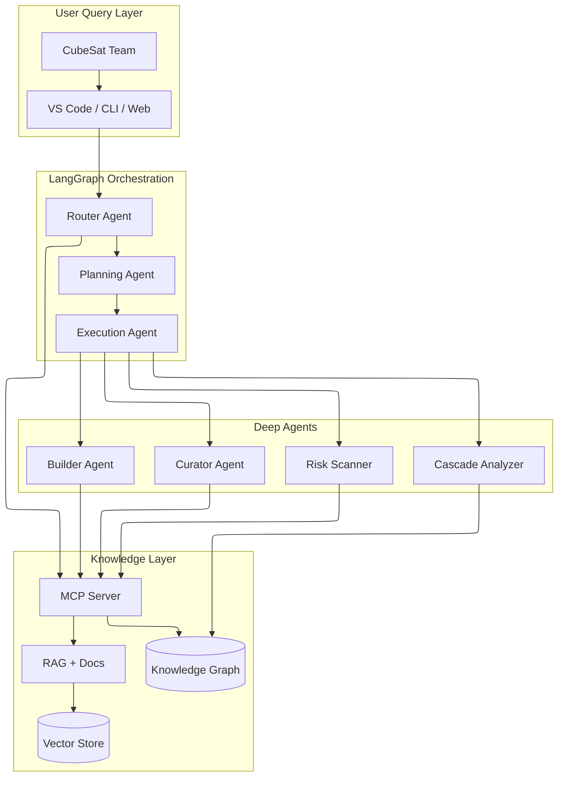
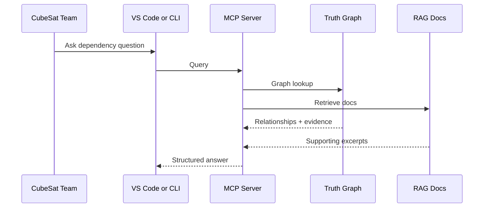
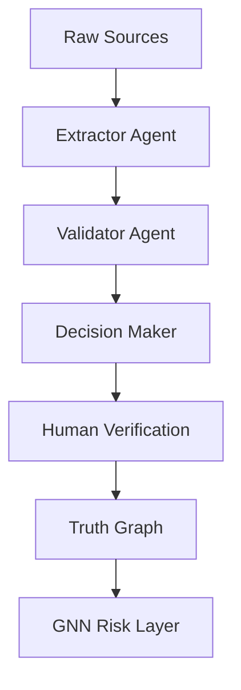
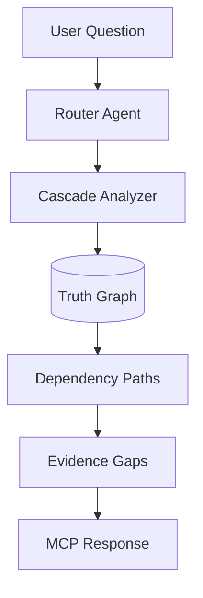

# PROVES Kit Agent: System Architecture

This page summarizes the current agentic system as implemented in PROVES Library and exposed through PROVES Kit Agent.

---

## High-Level Architecture

---

## MCP Query Lifecycle

---

## Truth Layer Pipeline

Only human-verified facts enter the truth graph.

---

## Cascade Analysis Flow

---

## MCP Server as the Knowledge Interface

The MCP server is the single interface for:

- Graph queries and cascade paths
- Evidence tracing and citations
- RAG retrieval across docs and entries
- IDE and CLI integrations for CubeSat teams

---

## GNN Risk Layer (Proves_AI)

The GNN layer uses the verified truth graph to estimate mission risk and cascade impact:

- GraphSAGE for graph risk and cascade reasoning
- XGBoost baseline for mission success probability
- Cross-encoder reranker for retrieval quality

Repo: https://github.com/Lizo-RoadTown/Proves_AI

---

## Why This Matters

- Makes hidden dependencies queryable
- Preserves institutional memory across cohorts
- Lets teams act on risks before integration
