[← Back to Home](/proveskit-agent/)

# The Living Documentation Library

Traditional documentation is static — someone writes it, publishes it, and it slowly goes stale. The PROVES Library is **living**: AI agents continuously extract knowledge, humans review critical items, and the knowledge graph grows over time.

---

## Why "Living"?

| Static Documentation | Living Library |
|---------------------|----------------|
| Written once, updated rarely | Continuously extracted and validated |
| Organized by author's preference | Organized by relationships |
| Searched by keywords | Queried by meaning and connections |
| Goes stale when teams change | Persists across team rotations |
| Lives in one place | Links to original sources |

---

## How Knowledge Gets Captured

### Step 1: Documentation Sources

The system ingests documentation from:

- **F´ Framework** — NASA/JPL flight software architecture, components, ports
- **PROVES Kit** — Cal Poly CubeSat hardware, assembly, testing
- **PySquared** — STEM flight computer documentation
- **University Repos** — Issues, PRs, commits with lessons learned

### Step 2: AI Extraction

The Curator Agent reads documentation and extracts:

```
📄 Document: "PROVES Kit Power Management Guide"

🔍 Extracted Dependencies:
  1. BatteryCharger → SolarPanel (depends_on, MEDIUM)
     "Charger requires solar input for trickle charge mode"
     
  2. LoadSwitch → PowerRail (enables, HIGH)
     "Load switch controls sensor power - failure = no telemetry"
     
  3. PowerBudget → RadioDutyCycle (constrains, HIGH)
     "Exceeding 50% duty cycle depletes batteries in eclipse"
```

### Step 3: Human Review

HIGH criticality items require human approval:

```
[CURATOR] Found HIGH criticality dependency:
  LoadSwitch → PowerRail (enables)
  Evidence: Lines 23-31, power_management.md
  Impact: Failure disables all sensor telemetry
  
  Approve for knowledge graph? [y/n]
```

### Step 4: Knowledge Graph Storage

Approved items become queryable nodes and edges:

```sql
-- Query: What controls sensor power?
SELECT source.name, rel.type, target.name
FROM kg_relationships rel
JOIN kg_nodes source ON rel.source_id = source.id
JOIN kg_nodes target ON rel.target_id = target.id
WHERE target.name LIKE '%sensor%power%';

-- Result:
-- LoadSwitch | enables | SensorPowerRail
-- PowerBudget | constrains | SensorDutyCycle
```

---

## What Gets Stored

### Three Types of Knowledge

**1. Build Knowledge** — How to assemble and validate
- Assembly and integration guides
- Hardware references and specifications
- Flight software configuration
- Testing procedures and checklists

**2. Architecture Knowledge** — How systems are structured
- F´ component patterns
- Port definitions and topologies
- Build system and toolchain setup
- GDS (Ground Data System) usage

**3. Operational Knowledge** — How things behave in practice
- Configuration files and parameters
- Test results and anomaly reports
- Issue resolutions with root causes
- Lessons learned from past missions

### The Entry Format

Every library entry follows this structure:

```yaml
---
title: "I2C Address Conflict Resolution"
type: pattern
domain: hardware
tags: [i2c, sensors, conflict]
quality_score: 0.85
sources:
  - "PROVES Kit IMU Integration Guide, Lines 45-67"
  - "GitHub Issue #142: BNO055 sensor not responding"
---

## Observed Context
When using multiple I2C sensors (MPU-6050 and BNO055), address
conflicts can cause one sensor to stop responding.

## Root Cause
Both sensors default to I2C address 0x68. The MPU-6050 has an
AD0 pin to select 0x68 or 0x69, but the BNO055 is fixed.

## Resolution
Use a TCA9548A I2C multiplexer to place each sensor on a
separate I2C bus segment.

## Verification
- I2C scan shows both sensors responding
- Continuous read test passes for 24 hours
- No address collision errors in logs

## Related Artifacts
- Component: ImuManager (fprime-pysquared)
- Hardware: TCA9548A Multiplexer
- Pattern: I2C Bus Conflict
```

---

## How to Query the Library

### By Keyword Search

> "I2C conflict"

Returns entries containing those words, ranked by relevance.

### By Relationship

> "What components depend on LinuxI2cDriver?"


### By Cascade Path

> "What happens if PowerRail_3V3 voltage drops?"


### By Similar Issues

> "Show me problems similar to 'radio causes resets'"

Returns entries with matching symptoms, causes, or resolutions.

---

## Quality Scoring

Every entry gets a quality score (0.0 to 1.0) based on:

| Factor | Weight | Criteria |
|--------|--------|----------|
| **Citations** | 30% | Links to original sources |
| **Verification** | 25% | Test results or confirmation |
| **Completeness** | 20% | All sections filled |
| **Specificity** | 15% | Concrete details, not vague |
| **Recency** | 10% | How recently validated |

**Score interpretation:**
- 0.8+ = High confidence, well-documented
- 0.5-0.8 = Useful but verify independently  
- Below 0.5 = Needs more evidence

---

## Contributing Knowledge

### Automatic Contribution

When you use PROVES tools:
1. Risk Scanner finds a new pattern → prompts you to document
2. Curator Agent finds missing info → asks for clarification
3. Resolved issues → extracted and added to library

### Manual Contribution

Submit a library entry via:
- Pull request to PROVES_LIBRARY repository
- IDE extension submission form (planned)
- CLI tool for structured input (planned)

### Review Process

1. **Automatic validation** — Schema compliance, duplicate check
2. **Quality scoring** — Algorithm rates entry quality
3. **Human review** — HIGH criticality or low-score entries
4. **Merge to library** — Becomes queryable

---

## The Virtuous Cycle

```mermaid
graph TB
    A[📄 Documentation] -->|AI extracts| B[📥 Raw Knowledge]
    B -->|Human reviews| C[✅ Approved Entries]
    C -->|Stored in| D[🗄️ Knowledge Graph]
    D -->|Powers| E[🔍 Search & Queries]
    E -->|Helps teams find| F[💡 Solutions]
    F -->|Teams contribute| A
    
    style D fill:#4D96FF
    style C fill:#6BCB77
```



**The more people use it, the better it gets:**
- More queries → better understanding of what's missing
- More contributions → more complete knowledge graph
- More validations → higher quality entries
- More teams → more diverse knowledge sources

---

## Privacy & Attribution

### What We Don't Store

- ❌ Original copyrighted content (only citations and excerpts)
- ❌ Personal information
- ❌ Proprietary code or secrets
- ❌ Individual blame or attribution

### What We Do Store

- ✅ Citations with links to public sources
- ✅ Extracted relationships and metadata
- ✅ Verification references
- ✅ Organizational attribution (team X discovered Y)

---

## Learn More

- **[Architecture](/proveskit-agent/architecture/)** — How the knowledge graph works
- **[For Developers](/proveskit-agent/developers/)** — How to use and contribute
- **[PROVES_LIBRARY Repository](https://github.com/Lizo-RoadTown/PROVES_LIBRARY)** — Working code

[← Back to Home](/proveskit-agent/)
