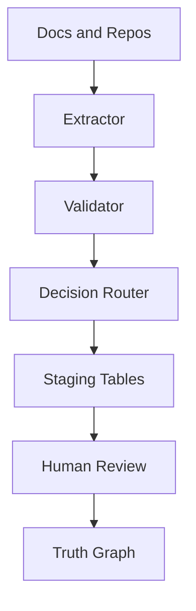

# Technical Architecture

Implementation details for the PROVES Kit Agent system (backed by PROVES Library).

---

## Core Data Stores

- **Neon PostgreSQL knowledge graph** with ERV relationships and evidence
- **Staging tables** for human verification and promotion to truth
- **LangGraph checkpointer tables** for agent state persistence
- **Vector store** for retrieval (pgvector or external)

---

## Curator Workflow (LangGraph)

**Sub-agents:**
- Extractor: capture and normalize dependencies
- Validator: confidence checks and anomaly flags
- Storage: writes to staging and truth graph

---

## MCP Server

MCP provides a single interface for graph and RAG queries:

- `/search` and `/entry/{id}` for document retrieval
- `/graph/query` and `/graph/cascade` for dependency traversal
- `/graph/evidence` for citation chains and provenance

This enables IDE tooling, CLI access, and other agents to share the same source of truth.

---

## GNN and ML Stack (Proves_AI)

The ML stack trains on the verified graph:

- GraphSAGE for cascade and risk scoring
- XGBoost baseline for mission success probability
- Cross-encoder reranker for retrieval quality
- pgvector embeddings for semantic recall

Repo: https://github.com/Lizo-RoadTown/Proves_AI

---

## Operational Scripts

Useful entry points in PROVES Library:

- `curator-agent/run_with_approval.py` - run curator with HITL
- `curator-agent/daily_extraction.py` - incremental extraction runs
- `curator-agent/check_environment.py` - environment readiness checks
- `curator-agent/view_progress.py` - extraction progress summary

---

## Reference Docs

- https://github.com/Lizo-RoadTown/PROVES_LIBRARY
- https://github.com/Lizo-RoadTown/PROVES_LIBRARY/blob/master/GETTING_STARTED.md
- https://github.com/Lizo-RoadTown/PROVES_LIBRARY/blob/master/docs/AGENTIC_ARCHITECTURE.md
