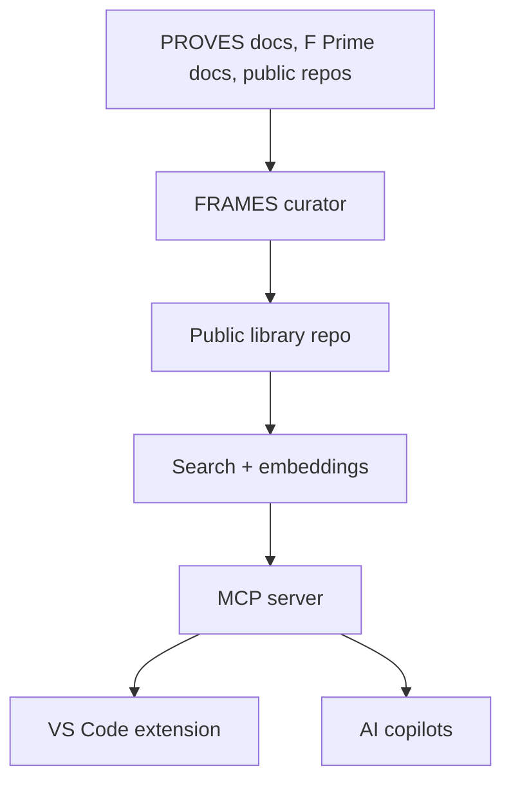
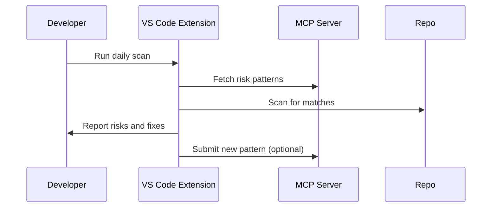

# Technical Architecture

This system has two core products:

1) An MCP-backed living documentation library
2) A VS Code risk scan extension

It does not generate flight software.

---

## System Overview



---

## Storage Model

### Canonical Library (Public Repo)

- Markdown entries with small metadata blocks
- Review before merge
- Citations and excerpts only

This repo is the system of record and keeps the library transparent and open.

### Search Index

- Built from the canonical library
- Used by the MCP server for fast retrieval
- Can be local (SQLite) or shared (Postgres with embeddings)

---

## MCP Server

The MCP server exposes:

- Search across lessons, risk patterns, and docs
- Entry retrieval with citations
- Source references to repos and docs

This makes the library interrogatable by any AI tool in VS Code.

---

## Risk Scan Extension

The VS Code extension:

1) Fetches risk patterns from MCP
2) Scans the local repo for matches
3) Reports likely mission-critical issues
4) Links to fixes and verification steps

New patterns can be submitted back to the library for review.

---

## Entry Format (No Blame)

```
Issue
- What happened:
- Where it lives (component/repo/doc):
- Likely knowledge location (file/test/doc/role):
- Fix summary:
- How to verify:
```

The system owns outcomes. We log where the fix lives, not who caused the problem.

---

## Data Flow



