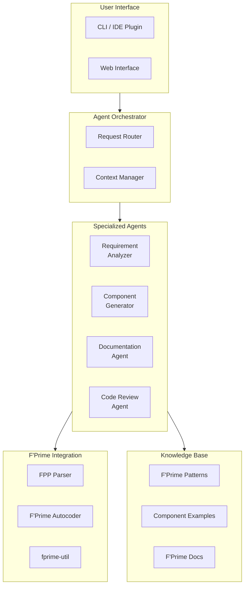
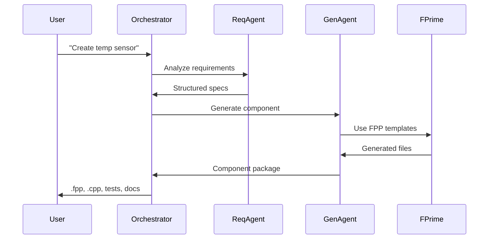
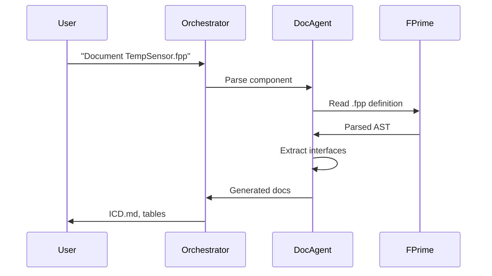

# Technical Architecture

The PROVES Kit Agent system architecture, implementation details, and F'Prime integration.

---

## System Overview



---

## Agent Architecture

### Multi-Agent System

Similar to **FRAMES**, uses specialized agents coordinated by an orchestrator:

| Agent | Purpose | Inputs | Outputs |
|-------|---------|--------|---------|
| **Requirement Analyzer** | Extract component specs from natural language | User description, context | Structured requirements |
| **Component Generator** | Create F'Prime components | Requirements, patterns | `.fpp`, C++, tests |
| **Documentation Agent** | Generate ICDs and tables | Component definitions | Markdown docs |
| **Review Agent** | Validate F'Prime patterns | Source code, topology | Issue report, suggestions |

### Orchestrator

**Responsibilities:**
- Route user requests to appropriate agent(s)
- Manage conversation context and state
- Coordinate multi-agent workflows
- Integrate agent outputs

**Example workflow:**
```
User: "Create temperature sensor component"
  ↓
Orchestrator → Requirement Analyzer
  → Extract: sensor type, telemetry, commands, events
  ↓
Orchestrator → Component Generator
  → Generate: .fpp, C++, tests
  ↓
Orchestrator → Documentation Agent
  → Generate: ICD, command table
  ↓
User: Receives complete component package
```

---

## F'Prime Integration

### FPP (F Prime Prime) Parsing

The agent understands F'Prime's component definition language:

**Input FPP:**
```fpp
active component TempSensor {
  telemetry Temperature: F32
  event TemperatureThreshold(temp: F32) severity warning high
  command ReadTemperature() async
}
```

**Agent extracts:**
- Component type (active)
- Ports (implicit)
- Telemetry channels
- Events with severity
- Commands with synchronicity

### Code Generation

Leverages F'Prime autocoding patterns:

1. Parse `.fpp` component definition
2. Generate C++ using F'Prime templates
3. Scaffold handlers with TODO markers
4. Create unit test framework

**Generated structure:**
```
TempSensor/
├── TempSensor.fpp          # Component definition
├── TempSensor.cpp          # Implementation
├── TempSensor.hpp          # Header
└── test/
    ├── TesterBase.cpp      # Auto-generated test base
    └── TempSensorTest.cpp  # Custom tests
```

### Build Integration

Works with `fprime-util`:

```bash
# Agent generates component
agent generate-component "TempSensor"

# Use standard F'Prime build
cd TempSensor
fprime-util build
fprime-util check  # Run unit tests
```

---

## Knowledge Base

### F'Prime Pattern Library

Agent trained on common F'Prime patterns:

**Component patterns:**
- Active vs. passive components
- Port types and connections
- Command handlers
- Telemetry channels
- Event logging

**Topology patterns:**
- Component instantiation
- Connection graphs
- Thread allocation
- Buffer management

### Example Repository

Agent references PROVES Kit components:

- Real flight software examples
- Validated patterns
- Documented design decisions
- Test strategies

### F'Prime Documentation

Integrated access to:
- F'Prime User Manual
- API documentation
- Best practices guides
- Common pitfalls

---

## Implementation Stack

### Language Models

**Primary:** Claude 3.5 Sonnet (Anthropic)
- Strong code generation
- Excellent context handling
- Reliable structured outputs

**Specialized tasks:**
- Requirement extraction: Claude 3 Haiku (fast, cost-effective)
- Code review: Claude 3.5 Sonnet (detailed analysis)

### Prompt Engineering

**Key techniques:**
- Few-shot learning with F'Prime examples
- Structured output formats (JSON schemas)
- Chain-of-thought for complex components
- Validation loops for correctness

### Tool Integration

**F'Prime tools:**
- `fprime-util` for build/test
- `fpp-to-cpp` for autocoding
- `fpp-check` for validation

**Development tools:**
- Git for version control
- VSCode extension (planned)
- CLI for scripting

---

## Data Flow

### Component Generation Flow



### Documentation Generation Flow



---

## Quality Assurance

### Validation Strategies

**Syntax validation:**
- Run `fpp-check` on generated `.fpp`
- Verify C++ compiles with `fprime-util build`
- Check test scaffolds are valid

**Pattern validation:**
- Compare to F'Prime style guide
- Verify port connection types
- Check thread safety in active components

**Semantic validation:**
- Does generated component match requirements?
- Are interfaces complete?
- Do tests cover key scenarios?

### Human-in-the-Loop

**Critical checkpoints:**
1. **Requirements review** — Before generation
2. **Code review** — After generation
3. **Test validation** — Before flight qualification
4. **Documentation review** — Before release

---

## Performance Considerations

### Response Time

**Typical latencies:**
- Requirement analysis: ~2-5 seconds
- Component generation: ~10-20 seconds
- Documentation: ~5-10 seconds
- Code review: ~15-30 seconds

**Optimization:**
- Cache common patterns
- Parallel agent execution where possible
- Incremental updates for docs

### Cost Optimization

**Token efficiency:**
- Use Haiku for simple tasks
- Structured outputs reduce token waste
- Cache F'Prime documentation

**Batch operations:**
- Generate multiple components in one session
- Bulk documentation updates

---

## Future Directions

### Planned Features

**Topology Assistant:**
- Suggest component connections
- Validate topology graphs
- Generate deployment diagrams

**Integration Testing:**
- Generate integration test scenarios
- Mock component interactions
- Hardware-in-loop test support

**Knowledge Capture:**
- Extract design rationale from commits
- Build institutional knowledge graph
- Support team transitions

### Research Questions

**Validation:**
- How accurate is agent-generated code vs. human-written?
- Does it actually accelerate development?
- What failure modes occur?

**Adoption:**
- What workflows benefit most from agents?
- What tasks should remain human-only?
- How to build trust in generated code?

---

## Open Source

**Status:** In development

**Planned release:**
- Agent orchestrator framework
- F'Prime integration tools
- Example prompts and patterns
- VSCode extension

**Repository:** TBD on PROVES Kit GitHub

---

## Technical Resources

**Architecture documentation:**
- Agent design patterns
- F'Prime integration guide
- Deployment instructions

**Developer guide:**
- Adding new agents
- Customizing prompts
- Extending knowledge base

**API reference:**
- Orchestrator API
- Agent interfaces
- Tool integration

---

## Contact

**Technical questions:**
Elizabeth Osborn | [eosborn@cpp.edu](mailto:eosborn@cpp.edu)

**Related projects:**
- [FRAMES Architecture](https://lizo-roadtown.github.io/Portfolio/technical/) — Similar multi-agent framework
- [PROVES Kit](https://github.com/proveskit) — F'Prime components and missions
- [F'Prime](https://github.com/nasa/fprime) — NASA's flight software framework
