[← Back to Home](/proveskit-agent/)

# Technical Details

This page covers the implementation details of PROVES Library — the data models, agent workflows, and system integration.

---

## System Overview

```mermaid
graph TB
    subgraph Sources[📄 Documentation Sources]
        FPrime[F´ Framework Docs]
        PROVES[PROVES Kit Docs]
        PySquared[PySquared Docs]
    end

    subgraph Agents[🤖 LangGraph Agent System]
        Curator[Curator Agent<br/>Claude Sonnet 4.5]
        Extractor[Extractor<br/>Sonnet 4.5]
        Validator[Validator<br/>Haiku 3.5]
        Storage[Storage<br/>Haiku 3.5]
    end

    subgraph Database[🗄️ Neon PostgreSQL]
        KGNodes[(kg_nodes)]
        KGRels[(kg_relationships)]
        Library[(library_entries)]
        Checkpoints[(checkpoints)]
    end

    subgraph Interfaces[🔌 Interfaces]
        MCP[MCP Server<br/>Planned]
        VSCode[VS Code Extension<br/>Planned]
        CLI[CLI Tools<br/>Available]
    end

    Sources --> Curator
    Curator --> Extractor
    Curator --> Validator
    Curator --> Storage
    Storage --> Database
    Database --> Interfaces

    style Curator fill:#E8AA42
    style Database fill:#4D96FF
```



---

## Data Models

### Knowledge Graph Nodes

```sql
CREATE TABLE kg_nodes (
    id UUID PRIMARY KEY DEFAULT gen_random_uuid(),
    name TEXT NOT NULL,
    node_type TEXT NOT NULL,  -- 'component', 'hardware', 'pattern', 'resource'
    description TEXT,
    properties JSONB DEFAULT '{}',
    embedding VECTOR(1536),   -- For semantic search
    created_at TIMESTAMPTZ DEFAULT NOW(),
    updated_at TIMESTAMPTZ DEFAULT NOW()
);
```

**Node Types:**

| Type | Description | Example |
|------|-------------|---------|
| `component` | Software component | ImuManager, RadioDriver |
| `hardware` | Physical hardware | MPU-6050, TCA9548A |
| `pattern` | Design pattern or anti-pattern | I2C Conflict, Power Cascade |
| `resource` | Shared resource | PowerRail_3V3, I2C_Bus |

### Knowledge Graph Relationships

```sql
CREATE TABLE kg_relationships (
    id UUID PRIMARY KEY DEFAULT gen_random_uuid(),
    source_id UUID REFERENCES kg_nodes(id),
    target_id UUID REFERENCES kg_nodes(id),
    relationship_type TEXT NOT NULL,  -- ERV types
    criticality TEXT DEFAULT 'MEDIUM',
    evidence TEXT,
    metadata JSONB DEFAULT '{}',
    created_at TIMESTAMPTZ DEFAULT NOW()
);

CREATE TYPE relationship_type AS ENUM (
    'depends_on',      -- Runtime dependency
    'requires',        -- Build-time requirement
    'enables',         -- Makes possible
    'conflicts_with',  -- Cannot coexist
    'mitigates',       -- Reduces risk
    'causes'           -- Leads to
);
```

### Library Entries

```sql
CREATE TABLE library_entries (
    id UUID PRIMARY KEY DEFAULT gen_random_uuid(),
    title TEXT NOT NULL,
    slug TEXT UNIQUE,
    entry_type TEXT,      -- 'guide', 'pattern', 'lesson', 'reference'
    domain TEXT,          -- 'hardware', 'software', 'operations'
    content TEXT,
    summary TEXT,
    tags TEXT[],
    sources TEXT[],       -- Citation URLs
    quality_score DECIMAL(3,2),
    embedding VECTOR(1536),
    created_at TIMESTAMPTZ DEFAULT NOW()
);
```

---

## Agent Architecture

### The Sub-Agents-as-Tools Pattern

```python
# curator-agent/src/curator/agent.py

from langgraph.graph import StateGraph, END
from langchain_anthropic import ChatAnthropic

# Main curator uses Sonnet for complex reasoning
curator_llm = ChatAnthropic(model="claude-sonnet-4-20250514")

# Sub-agents use Haiku for simple tasks (90% cheaper)
validator_llm = ChatAnthropic(model="claude-3-5-haiku-20241022")
storage_llm = ChatAnthropic(model="claude-3-5-haiku-20241022")

# Extractor needs Sonnet for accurate extraction
extractor_llm = ChatAnthropic(model="claude-sonnet-4-20250514")
```

### Agent State

```python
from typing import TypedDict, List, Optional

class CuratorState(TypedDict):
    # Input
    document_path: str
    document_content: str
    
    # Extraction results
    extracted_dependencies: List[dict]
    validation_results: List[dict]
    
    # Approval tracking
    pending_approval: List[dict]
    approved_items: List[dict]
    rejected_items: List[dict]
    
    # Status
    current_step: str
    error: Optional[str]
```

### Workflow Graph

```python
from langgraph.graph import StateGraph

workflow = StateGraph(CuratorState)

# Add nodes
workflow.add_node("read_document", read_document)
workflow.add_node("extract_dependencies", extract_dependencies)
workflow.add_node("validate_quality", validate_quality)
workflow.add_node("check_criticality", check_criticality)
workflow.add_node("request_approval", request_approval)
workflow.add_node("store_results", store_results)

# Add edges
workflow.add_edge("read_document", "extract_dependencies")
workflow.add_edge("extract_dependencies", "validate_quality")
workflow.add_edge("validate_quality", "check_criticality")

# Conditional edge based on criticality
workflow.add_conditional_edges(
    "check_criticality",
    route_by_criticality,
    {
        "needs_approval": "request_approval",
        "auto_approve": "store_results"
    }
)

workflow.add_edge("request_approval", "store_results")
workflow.add_edge("store_results", END)
```

---

## Human-in-the-Loop (HITL)

### Criticality-Based Routing

```python
def route_by_criticality(state: CuratorState) -> str:
    """Route based on highest criticality in pending items."""
    for dep in state["extracted_dependencies"]:
        if dep["criticality"] == "HIGH":
            return "needs_approval"
    return "auto_approve"
```

### Approval Interface

```python
def request_approval(state: CuratorState) -> CuratorState:
    """Present HIGH criticality items for human review."""
    pending = [d for d in state["extracted_dependencies"] 
               if d["criticality"] == "HIGH"]
    
    approved = []
    rejected = []
    
    for dep in pending:
        print(f"\n[CURATOR] Found HIGH criticality dependency:")
        print(f"  {dep['source']} → {dep['target']} ({dep['relationship']})")
        print(f"  Evidence: {dep['evidence']}")
        print(f"  Reason: {dep['reason']}")
        
        response = input("\n  Approve? [y/n]: ").strip().lower()
        
        if response == 'y':
            approved.append(dep)
        else:
            rejected.append(dep)
    
    return {
        **state,
        "approved_items": approved,
        "rejected_items": rejected
    }
```

---

## Database Operations

### Connection Pooling

```python
# scripts/db_connector.py

import os
from psycopg_pool import ConnectionPool

DATABASE_URL = os.getenv("DATABASE_URL")

pool = ConnectionPool(
    DATABASE_URL,
    min_size=1,
    max_size=10,
    timeout=30
)

def execute_query(query: str, params: tuple = None):
    """Execute query with connection from pool."""
    with pool.connection() as conn:
        with conn.cursor() as cur:
            cur.execute(query, params)
            if cur.description:
                return cur.fetchall()
            conn.commit()
```

### Graph Manager

```python
# scripts/graph_manager.py

class GraphManager:
    def create_node(self, name: str, node_type: str, 
                    description: str = None, properties: dict = None) -> str:
        """Create a knowledge graph node."""
        query = """
            INSERT INTO kg_nodes (name, node_type, description, properties)
            VALUES (%s, %s, %s, %s)
            RETURNING id
        """
        result = execute_query(query, (name, node_type, description, 
                                       json.dumps(properties or {})))
        return str(result[0][0])
    
    def create_relationship(self, source_id: str, target_id: str,
                           relationship_type: str, criticality: str = "MEDIUM",
                           evidence: str = None) -> str:
        """Create an ERV relationship between nodes."""
        query = """
            INSERT INTO kg_relationships 
            (source_id, target_id, relationship_type, criticality, evidence)
            VALUES (%s, %s, %s, %s, %s)
            RETURNING id
        """
        return execute_query(query, (source_id, target_id, 
                                    relationship_type, criticality, evidence))
    
    def get_dependencies(self, node_name: str) -> list:
        """Get all nodes that depend on the given node."""
        query = """
            SELECT n.name, r.relationship_type, r.criticality
            FROM kg_relationships r
            JOIN kg_nodes n ON r.source_id = n.id
            JOIN kg_nodes target ON r.target_id = target.id
            WHERE target.name = %s
        """
        return execute_query(query, (node_name,))
```

---

## LangGraph Checkpointing

### State Persistence

```python
# scripts/setup_checkpointer.py

from langgraph.checkpoint.postgres import PostgresSaver

checkpointer = PostgresSaver.from_conn_string(DATABASE_URL)

# Create tables for checkpointing
checkpointer.setup()
```

### Using Checkpoints

```python
# Resume from checkpoint
config = {"configurable": {"thread_id": "extraction-job-001"}}

# Run with checkpointing
result = workflow.invoke(initial_state, config=config)

# Later: resume if interrupted
result = workflow.invoke(None, config=config)  # Resumes from last checkpoint
```

---

## Planned: MCP Server

### Endpoint Design

```python
# Planned: mcp_server/main.py

from fastapi import FastAPI
from pydantic import BaseModel

app = FastAPI(title="PROVES Library MCP Server")

class SearchRequest(BaseModel):
    query: str
    filters: dict = {}
    limit: int = 10

@app.post("/search")
async def search(request: SearchRequest):
    """Semantic + keyword search across library."""
    results = await search_library(
        query=request.query,
        filters=request.filters,
        limit=request.limit
    )
    return {"results": results}

@app.get("/entry/{entry_id}")
async def get_entry(entry_id: str):
    """Fetch a specific library entry."""
    return await fetch_entry(entry_id)

@app.post("/graph/query")
async def graph_query(query: dict):
    """Query the knowledge graph."""
    return await execute_graph_query(query)

@app.post("/graph/cascade")
async def cascade_analysis(start_node: str, resource_type: str):
    """Find cascade paths through shared resources."""
    return await find_cascade_paths(start_node, resource_type)
```

---

## Planned: Risk Scanner

### Pattern Definition

```python
# Planned: risk_scanner/patterns.py

RISK_PATTERNS = [
    {
        "id": "i2c_address_conflict",
        "name": "I2C Address Conflict",
        "description": "Multiple devices with same I2C address",
        "severity": "HIGH",
        "detection": {
            "type": "ast_pattern",
            "language": "python",
            "pattern": "I2C.*address.*0x[0-9a-fA-F]+"
        },
        "mitigation": "Use TCA9548A multiplexer or change device address"
    },
    {
        "id": "power_budget_exceeded",
        "name": "Power Budget Exceeded",
        "description": "Total power draw exceeds available budget",
        "severity": "HIGH",
        "detection": {
            "type": "config_check",
            "check": "sum(component_power) > power_budget"
        },
        "mitigation": "Reduce duty cycles or add power storage"
    }
]
```

### Scanner Workflow

```python
# Planned: risk_scanner/scanner.py

async def scan_repository(repo_path: str) -> list:
    """Scan a repository for known risk patterns."""
    risks_found = []
    
    for pattern in RISK_PATTERNS:
        matches = await detect_pattern(repo_path, pattern)
        for match in matches:
            risks_found.append({
                "pattern": pattern["id"],
                "severity": pattern["severity"],
                "location": match["file"] + ":" + str(match["line"]),
                "mitigation": pattern["mitigation"]
            })
    
    return risks_found
```

---

## Technology Stack

| Component | Technology | Version |
|-----------|------------|---------|
| **Agent Framework** | LangGraph | 0.2.x |
| **LLM Provider** | Anthropic Claude | Sonnet 4.5, Haiku 3.5 |
| **Database** | Neon PostgreSQL | 16 |
| **Vector Search** | pgvector | 0.7.x |
| **Tracing** | LangSmith | Optional |
| **Language** | Python | 3.11+ |

---

## Learn More

- **[Architecture](/proveskit-agent/architecture/)** — System design overview
- **[For Developers](/proveskit-agent/developers/)** — Setup and contribution guide
- **[PROVES_LIBRARY Repository](https://github.com/Lizo-RoadTown/PROVES_LIBRARY)** — Source code

[← Back to Home](/proveskit-agent/)
